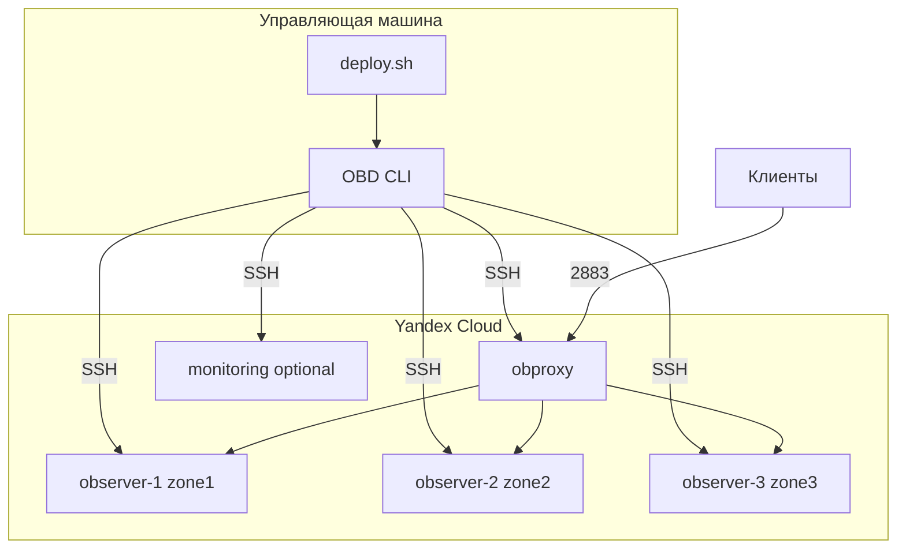

# Развёртывание OceanBase в Yandex Cloud

Автоматизация развёртывания масштабируемого кластера **OceanBase Community Edition** на виртуальных машинах [Yandex Cloud](https://cloud.yandex.ru/) с использованием [OBD](https://www.oceanbase.com/docs/common-obd-cn-1000000005246289) и рекомендаций [oceanbase-skills](https://github.com/oceanbase/oceanbase-skills).

## Возможности

- Настраиваемые **профили ВМ по ролям** (observer, obproxy, configserver, monitoring)
- Оптимальные типы дисков YC: non-replicated для реплицируемых data, io-m3 для log/boot
- Подготовка серверов по best practices (sysctl, limits, монтирование дисков)
- Генерация конфигурации OBD и развёртывание кластера
- Горизонтальное масштабирование (`scale_out`)
- **OceanBase Cloud Platform (OCP)** — отдельная ВМ и автоматическая установка через OBD
- Альтернатива: Terraform-модуль для создания ВМ

## Архитектура



## Требования

| Компонент | Назначение |
|-----------|------------|
| [Yandex Cloud CLI (`yc`)](https://cloud.yandex.ru/docs/cli/quickstart) | Создание ВМ |
| SSH-ключи | Доступ к ВМ и OBD |
| Python 3 + PyYAML | Генерация конфигурации |
| OBD | Развёртывание OceanBase (устанавливается на шаге deploy) |

Рекомендуемые ресурсы **на каждый observer-узел** (production, [oceanbase-skills/cluster-management](https://github.com/oceanbase/oceanbase-skills)):

- минимум **3 узла** для HA
- **4+ vCPU**, **16+ GB RAM**, **100+ GB SSD** (data disk)

## Быстрый старт

```bash
# 0. Подготовка окружения Python
sudo apt install python3-venv
python3 -m venv venv
. ./venv/bin/activate
pip3 install -U pip

# 1. Зависимости
pip install -r requirements.txt
# настройка Yandex Cloud
curl -sSL https://storage.yandexcloud.net/yandexcloud-yc/install.sh | bash
yc init
# установка obd
bash -c "$(curl -s https://obbusiness-private.oss-cn-shanghai.aliyuncs.com/download-center/opensource/oceanbase-all-in-one/installer.sh)"
source ~/.oceanbase-all-in-one/bin/env.sh

# 2. Конфигурация
cp config/deploy.yaml.example config/deploy.yaml
# Отредактируйте: folder_id, ssh-ключи, ресурсы ВМ, количество узлов

# 3. Полное развёртывание
chmod +x scripts/*.sh scripts/lib/*.sh
./scripts/deploy.sh all
```

Пошаговый режим:

```bash
./scripts/deploy.sh check       # проверка
./scripts/deploy.sh provision   # async: диски → ВМ → READY → SSH
./scripts/deploy.sh prepare     # подготовка серверов
./scripts/deploy.sh config      # obd-cluster.yaml
./scripts/deploy.sh deploy      # obd cluster deploy + start
```

`provision` создаёт ресурсы асинхронно (как [ydb-snippets/admin/vms](https://github.com/zinal/ydb-snippets/tree/main/admin/vms)):
1. Secondary-диски (`--async`, retry при rate limit)
2. Ожидание `READY` дисков
3. ВМ с `--attach-disk` (`--async`)
4. Ожидание `RUNNING`/`STOPPED`
5. Проверка SSH-доступа

## Настройка (`config/deploy.yaml`)

Секции не дублируют друг друга:

| Секция | Назначение |
|--------|------------|
| `yandex_cloud` | Инфраструктура YC: zone, subnet, SSH, **образ ОС**, network_acceleration |
| `vm_defaults` | Общие defaults ВМ: platform, core_fraction |
| `vm_profiles` | Ресурсы по ролям: observer, obproxy, configserver, monitoring, **ocp** |
| `oceanbase` | Параметры кластера, OBD, auto-tune |
| `ocp` | OceanBase Cloud Platform: порт, пароли, meta/monitor tenants |

```yaml
yandex_cloud:
  image_folder_id: standard-images
  image_family: ubuntu-2204-lts
  # или image_name: redsoft-red-os-standart-server-7-3-v20240402
  network_acceleration: software-accelerated

vm_defaults:
  platform: standard-v3
  core_fraction: 100

vm_profiles:
  observer:                    # oceanbase-ce + obagent
    count: 3
    cores: 8                   # мин. 4
    memory_gb: 32              # мин. 16
    boot_disk:
      type: network-ssd-io-m3   # home_path — потеря недопустима
    data_disk:
      type: network-ssd-nonreplicated  # SSTable, реплицируется Paxos
      size_gb: 558             # кратно 93 GB
    log_disk:
      enabled: true
      type: network-ssd-io-m3  # clog — потеря недопустима
      size_gb: 279

  obproxy:                     # лёгкий stateless прокси
    count: 2
    cores: 2
    memory_gb: 4

  configserver:
    dedicated: false           # true — отдельная ВМ

  monitoring:
    enabled: false
    cores: 4
    memory_gb: 16

  ocp:                         # OceanBase Cloud Platform (отдельная ВМ)
    enabled: false
    cores: 4
    memory_gb: 16
```

При `vm_profiles.ocp.enabled: true` и `ocp.enabled: true` разворачивается веб-консоль OCP на отдельной ВМ. См. [docs/ocp-deployment.md](docs/ocp-deployment.md).

При `vm_profiles.monitoring.enabled: true` автоматически включаются Prometheus и Grafana (OBD). На **всех** узлах кластера устанавливается **node_exporter** (порт 9100 по умолчанию); Prometheus на monitoring-ВМ собирает OS-метрики (`job: node_exporter`) и метрики OceanBase через OBAgent (`node`, `ob_basic`, `ob_extra`, `agent`).

Секция `monitoring:` в config:

```yaml
monitoring:
  node_exporter:
    enabled: true
    port: 9100
    version: "1.8.2"
  prometheus:
    port: 9090
  obagent:
    http_port: 8088
    basic_auth_user: admin
    basic_auth_password: oceanbase
```

Проверка соответствия рекомендациям OceanBase:

```bash
python3 scripts/lib/vm_profiles.py validate --config config/deploy.yaml
```

Формат образа ОС — как в [ydb-snippets/admin/vms](https://github.com/zinal/ydb-snippets/tree/main/admin/vms): `image-folder-id=standard-images,image-family=...`. Без `image-folder-id` Yandex Cloud не находит публичные образы.

### Типы дисков по умолчанию

| Диск | Тип | Обоснование |
|------|-----|-------------|
| Observer data | `network-ssd-nonreplicated` | Данные реплицируются между узлами |
| Observer log | `network-ssd-io-m3` | Журнал транзакций, потеря недопустима |
| Observer boot | `network-ssd-io-m3` | Бинарники и home_path |
| Monitoring data | `network-ssd-io-m3` | Метрики, потеря нежелательна |

## Структура репозитория

```
├── docs/
│   ├── component-vm-sizing.md         # анализ профилей ВМ по компонентам
│   ├── ocp-deployment.md              # OceanBase Cloud Platform (OCP)
│   └── haproxy-obproxy-tcp-lb.md      # HAProxy tcp LB перед obproxy
├── config/
│   ├── deploy.yaml.example            # шаблон конфигурации
│   └── haproxy-obproxy-tcp-lb.cfg.example
├── scripts/
│   ├── lib/vm_profiles.py       # профили, валидация, округление дисков
│   ├── lib/yc-async.sh          # async + retry + wait (ydb-snippets pattern)
│   ├── deploy.sh                # главный сценарий
│   ├── 00-check-prerequisites.sh
│   ├── 01-provision-vms.sh      # yc compute instance create
│   ├── 02-prepare-servers.sh    # sysctl, диски, пользователь
│   ├── 03-generate-obd-config.py
│   ├── 04-deploy-cluster.sh     # obd cluster deploy/start
│   ├── 05-scale-out.sh          # добавление observer-узлов
│   ├── deploy-ocp.sh            # развёртывание OCP (отдельная ВМ)
│   ├── 02-prepare-ocp.sh        # подготовка OCP-ВМ (Java, clockdiff)
│   └── 99-destroy.sh
├── terraform/                   # опциональный IaC
├── generated/                   # inventory.env, obd-cluster.yaml
└── skills/README.md             # интеграция oceanbase-skills
```

SSH и подготовка серверов используют **внутренний DNS Yandex Cloud** (`<имя-вм>.ru-central1.internal`) — он стабилен при остановке/перезапуске ВМ. Конфигурация OBD (`generated/obd-cluster.yaml`) использует **IP-адреса** из `inventory.env`: OBD не принимает hostname в поле `ip`. После перезапуска ВМ обновите IP в инвентаре (`yc compute instance get`) и перегенерируйте конфиг (`./scripts/deploy.sh config`) перед `obd cluster start`.

## Масштабирование

Добавить 2 observer-узла:

```bash
./scripts/05-scale-out.sh 2
```

Скрипт создаёт ВМ, подготавливает серверы и выполняет `obd cluster scale_out`.

## Terraform (альтернатива)

```bash
cd terraform
export TF_VAR_deployment_name=ob-yc-prod
export TF_VAR_subnet_id=<subnet-id>
export TF_VAR_ssh_public_key="$(cat ~/.ssh/id_ed25519.pub)"
terraform init && terraform apply
```

После `terraform apply` заполните `generated/inventory.env` (поля `*_NAME` и `*_IP` для каждой ВМ) и продолжите с `./scripts/deploy.sh prepare`. Для SSH используются имена ВМ (FQDN), для OBD — IP из инвентаря.

## OceanBase Skills

Установите skills для AI-ассистента (Cursor/Claude Code):

```bash
npx skills add oceanbase/oceanbase-skills --skill oceanbase-deploy
```

Подробнее: [skills/README.md](skills/README.md)

## Удаление

```bash
# Только ВМ Yandex Cloud
./scripts/deploy.sh destroy

# ВМ + кластер OBD (удаление данных!)
./scripts/99-destroy.sh --destroy-obd
```

## Подключение к кластеру

После развёртывания:

```bash
obd cluster display <deployment_name>
mysql -h<obproxy_ip> -P2883 -uroot -p
# Obshell dashboard: http://<observer_ip>:2886
```

При нескольких ВМ obproxy (`vm_profiles.obproxy.count > 1`) можно поставить **HAProxy** как TCP-балансировщик с привязкой соединений по IP клиента — см. [docs/haproxy-obproxy-tcp-lb.md](docs/haproxy-obproxy-tcp-lb.md) и [config/haproxy-obproxy-tcp-lb.cfg.example](config/haproxy-obproxy-tcp-lb.cfg.example).

## Лицензия

MIT. OceanBase — отдельная лицензия OceanBase Community Edition.
