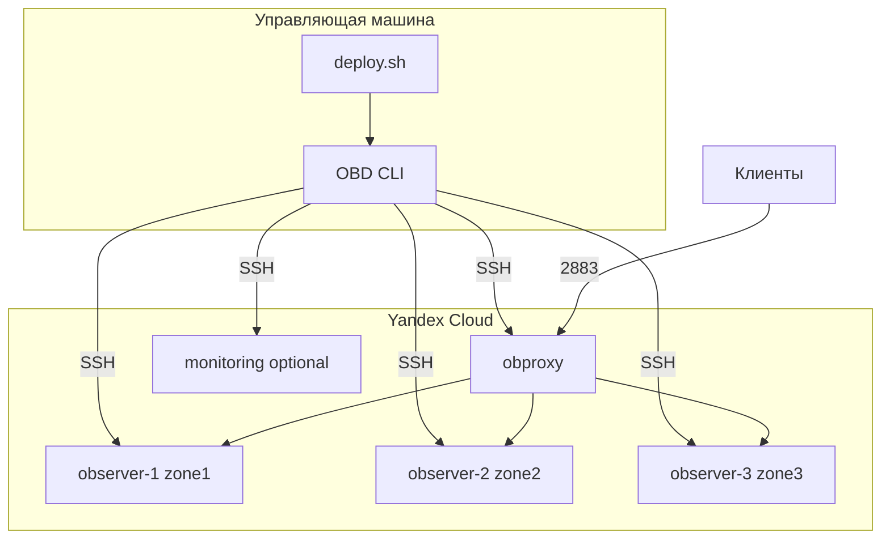

# Развёртывание OceanBase в Yandex Cloud

Автоматизация развёртывания масштабируемого кластера **OceanBase Community Edition** на виртуальных машинах [Yandex Cloud](https://cloud.yandex.ru/) с использованием [OBD](https://www.oceanbase.com/docs/common-obd-cn-1000000005246289) и рекомендаций [oceanbase-skills](https://github.com/oceanbase/oceanbase-skills).

## Возможности

- Настраиваемое количество и конфигурация ВМ (platform, vCPU, RAM, boot/data/log disks)
- Роли: observer, obproxy, monitoring (Prometheus/Grafana)
- Подготовка серверов по best practices (sysctl, limits, монтирование дисков)
- Генерация конфигурации OBD и развёртывание кластера
- Горизонтальное масштабирование (`scale_out`)
- Альтернатива: Terraform-модуль для создания ВМ

## Архитектура



## Требования

| Компонент | Назначение |
|-----------|------------|
| [Yandex Cloud CLI (`yc`)](https://cloud.yandex.ru/docs/cli/quickstart) | Создание ВМ |
| SSH-ключи | Доступ к ВМ и OBD |
| Python 3 + PyYAML | Генерация конфигурации |
| OBD | Развёртывание OceanBase (устанавливается на шаге deploy) |

Рекомендуемые ресурсы **на каждый observer-узел** (production, [oceanbase-skills/cluster-management](https://github.com/oceanbase/oceanbase-skills)):

- минимум **3 узла** для HA
- **4+ vCPU**, **16+ GB RAM**, **100+ GB SSD** (data disk)

## Быстрый старт

```bash
# 1. Зависимости
pip install -r requirements.txt
yc init   # настройка Yandex Cloud

# 2. Конфигурация
cp config/deploy.yaml.example config/deploy.yaml
# Отредактируйте: folder_id, ssh-ключи, ресурсы ВМ, количество узлов

# 3. Полное развёртывание
chmod +x scripts/*.sh scripts/lib/*.sh
./scripts/deploy.sh all
```

Пошаговый режим:

```bash
./scripts/deploy.sh check       # проверка
./scripts/deploy.sh provision   # создание ВМ
./scripts/deploy.sh prepare     # подготовка серверов
./scripts/deploy.sh config      # obd-cluster.yaml
./scripts/deploy.sh deploy      # obd cluster deploy + start
```

## Настройка ВМ (`config/deploy.yaml`)

Все параметры виртуальных машин задаются в одном файле:

```yaml
vm:
  platform: standard-v3      # тип платформы Yandex Cloud
  cores: 8                   # количество vCPU
  memory_gb: 32              # RAM
  core_fraction: 100         # доля vCPU (%)

  boot_disk:
    type: network-ssd        # network-hdd | network-ssd | network-ssd-nonreplicated
    size_gb: 50

  data_disk:
    enabled: true
    type: network-ssd
    size_gb: 500
    mount_point: /data

nodes:
  observers:
    count: 3                 # масштабируемое количество observer
    # Переопределение ресурсов для роли (null = vm.*)
    cores: null
    memory_gb: null

  obproxy:
    count: 1
    cores: 2
    memory_gb: 8
```

Доступные типы дисков Yandex Cloud: `network-hdd`, `network-ssd`, `network-ssd-nonreplicated`, `network-ssd-io-m3`.

## Структура репозитория

```
├── config/deploy.yaml.example   # шаблон конфигурации
├── scripts/
│   ├── deploy.sh                # главный сценарий
│   ├── 00-check-prerequisites.sh
│   ├── 01-provision-vms.sh      # yc compute instance create
│   ├── 02-prepare-servers.sh    # sysctl, диски, пользователь
│   ├── 03-generate-obd-config.py
│   ├── 04-deploy-cluster.sh     # obd cluster deploy/start
│   ├── 05-scale-out.sh          # добавление observer-узлов
│   └── 99-destroy.sh
├── terraform/                   # опциональный IaC
├── generated/                   # inventory.env, obd-cluster.yaml
└── skills/README.md             # интеграция oceanbase-skills
```

## Масштабирование

Добавить 2 observer-узла:

```bash
./scripts/05-scale-out.sh 2
```

Скрипт создаёт ВМ, подготавливает серверы и выполняет `obd cluster scale_out`.

## Terraform (альтернатива)

```bash
cd terraform
export TF_VAR_deployment_name=ob-yc-prod
export TF_VAR_subnet_id=<subnet-id>
export TF_VAR_ssh_public_key="$(cat ~/.ssh/id_ed25519.pub)"
terraform init && terraform apply
```

После `terraform apply` используйте IP из output для `generated/inventory.env` и продолжите с `./scripts/deploy.sh prepare`.

## OceanBase Skills

Установите skills для AI-ассистента (Cursor/Claude Code):

```bash
npx skills add oceanbase/oceanbase-skills --skill oceanbase-deploy
```

Подробнее: [skills/README.md](skills/README.md)

## Удаление

```bash
# Только ВМ Yandex Cloud
./scripts/deploy.sh destroy

# ВМ + кластер OBD (удаление данных!)
./scripts/99-destroy.sh --destroy-obd
```

## Подключение к кластеру

После развёртывания:

```bash
obd cluster display <deployment_name>
mysql -h<obproxy_ip> -P2883 -uroot -p
# Obshell dashboard: http://<observer_ip>:2886
```

## Лицензия

MIT. OceanBase — отдельная лицензия OceanBase Community Edition.
