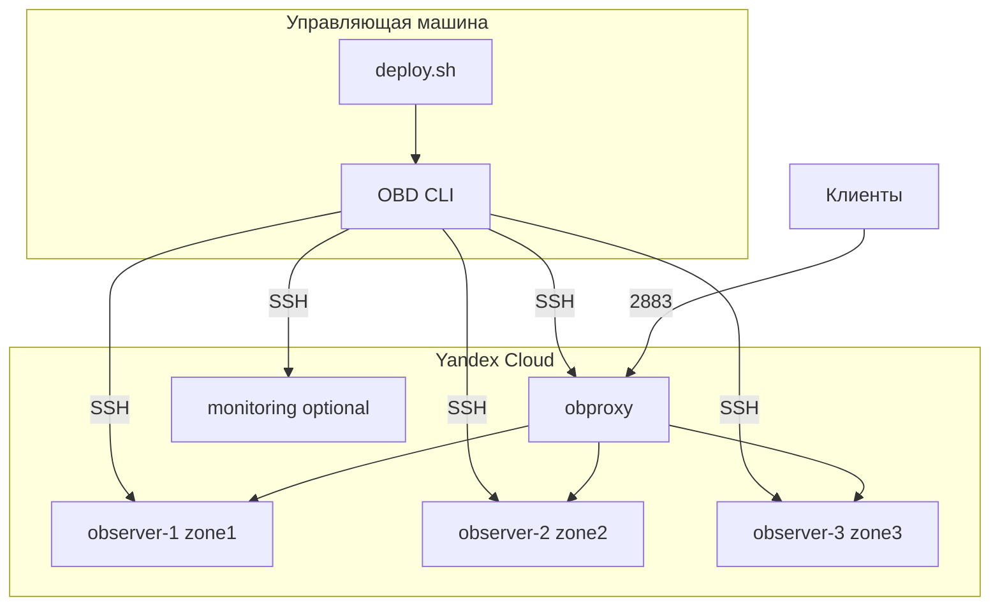

# Развёртывание OceanBase в Yandex Cloud

Автоматизация развёртывания масштабируемого кластера **OceanBase Community Edition** на виртуальных машинах [Yandex Cloud](https://cloud.yandex.ru/) с использованием [OBD](https://www.oceanbase.com/docs/common-obd-cn-1000000005246289) и рекомендаций [oceanbase-skills](https://github.com/oceanbase/oceanbase-skills).

## Возможности

- Настраиваемые **профили ВМ по ролям** (observer, obproxy, configserver, monitoring)
- Оптимальные типы дисков YC: non-replicated для реплицируемых data, io-m3 для log/boot
- Подготовка серверов по best practices (sysctl, limits, chrony, монтирование дисков)
- Генерация конфигурации OBD и безопасное staged-развёртывание: 3 seed observer → scale-out по 3
- Горизонтальное масштабирование (`scale_out`)
- Восстановление после полной потери одного хоста **observer** или **obproxy**
- **OceanBase Cloud Platform (OCP)** — отдельная ВМ и автоматическая установка через OBD
- Альтернатива: Terraform-модуль для создания ВМ

## Архитектура


```mermaid
flowchart TB
  subgraph control [Управляющая машина]
    OBD[OBD CLI]
    Scripts[deploy.sh]
  end

  subgraph yc [Yandex Cloud]
    O1[observer-1 zone1]
    O2[observer-2 zone2]
    O3[observer-3 zone3]
    P[obproxy]
    M[monitoring optional]
  end

  Scripts --> OBD
  OBD -->|SSH| O1
  OBD -->|SSH| O2
  OBD -->|SSH| O3
  OBD -->|SSH| P
  OBD -->|SSH| M
  Client[Клиенты] -->|2883| P
  P --> O1 & O2 & O3
```

## Требования

| Компонент | Назначение |
|-----------|------------|
| [Yandex Cloud CLI (`yc`)](https://cloud.yandex.ru/docs/cli/quickstart) | Создание ВМ |
| SSH-ключи | Доступ к ВМ и OBD |
| Python 3 + PyYAML | Генерация конфигурации |
| OBD | Развёртывание OceanBase (устанавливается на шаге deploy) |

Рекомендуемые ресурсы **на каждый observer-узел** (production, [oceanbase-skills/cluster-management](https://github.com/oceanbase/oceanbase-skills)):

- минимум **3 узла** для HA
- **4+ vCPU**, **16+ GB RAM**, **100+ GB SSD** (data disk)

## Быстрый старт

```bash
# 0. Подготовка окружения Python
sudo apt install python3-venv
python3 -m venv venv
. ./venv/bin/activate
pip3 install -U pip

# 1. Зависимости
pip install -r requirements.txt
# настройка Yandex Cloud
curl -sSL https://storage.yandexcloud.net/yandexcloud-yc/install.sh | bash
yc init
# установка obd
bash -c "$(curl -s https://obbusiness-private.oss-cn-shanghai.aliyuncs.com/download-center/opensource/oceanbase-all-in-one/installer.sh)"
source ~/.oceanbase-all-in-one/bin/env.sh

# 2. Конфигурация
cp config/deploy.yaml.example config/deploy.yaml
# Отредактируйте: folder_id, ssh-ключи, ресурсы ВМ, количество узлов

# 3. Полное развёртывание
chmod +x scripts/*.sh scripts/lib/*.sh
./scripts/deploy.sh all
```

Пошаговый режим:

```bash
./scripts/deploy.sh check       # зависимости, профили ВМ, сверка oceanbase с ресурсами ВМ
./scripts/deploy.sh provision   # async: диски → ВМ → READY → SSH
./scripts/deploy.sh prepare     # подготовка серверов
./scripts/deploy.sh config      # obd-cluster.yaml
./scripts/deploy.sh deploy      # prepare + 3 seed observer + scale-out остальных по 3
./scripts/deploy.sh diagnose    # зависание start (oceanbase/obshell bootstrap)
./scripts/deploy.sh tenant      # user tenant + пользователь + БД (после deploy)
```

`provision` создаёт ресурсы асинхронно (как [ydb-snippets/admin/vms](https://github.com/zinal/ydb-snippets/tree/main/admin/vms)):
1. Secondary-диски (`--async`, retry при rate limit)
2. Ожидание `READY` дисков
3. ВМ с `--attach-disk` (`--async`)
4. Ожидание `RUNNING`/`STOPPED`
5. Проверка SSH-доступа

В каталоге Yandex Compute Cloud по умолчанию не больше **15 одновременных операций**. Скрипт сам ждёт свободный слот и повторяет запрос при rate limit. Повторный `./scripts/deploy.sh provision` безопасен: уже созданные диски и ВМ пропускаются.

## Настройка (`config/deploy.yaml`)

Секции не дублируют друг друга:

| Секция | Назначение |
|--------|------------|
| `yandex_cloud` | Инфраструктура YC: zone, subnet, SSH, **образ ОС**, network_acceleration |
| `vm_defaults` | Общие defaults ВМ: platform, core_fraction |
| `vm_profiles` | Ресурсы по ролям: observer, obproxy, configserver, monitoring, **ocp** |
| `oceanbase` | Параметры кластера, OBD, auto-tune |
| `ocp` | OceanBase Cloud Platform: порт, пароли, meta/monitor tenants |
| `tenant` | User tenant после deploy: имя, пользователь, БД, пароли, режим (`mode` → `obd -o`) |

`tenant.mode` — сценарий оптимизации OBD (`obd cluster tenant create -o`, OceanBase ≥ 4.3):

| `mode` | Назначение |
|--------|------------|
| `express_oltp`, `oltp` | Простой OLTP: высокая конкуренция, короткие запросы (платежи, заказы) |
| `complex_oltp` | Сложный OLTP: join, подзапросы, PL, длинные транзакции |
| `olap` | Аналитика / real-time DW, колоночное хранение |
| `htap` | Смешанные OLTP и OLAP (значение по умолчанию) |
| `kv` | Key-value и wide-column нагрузки |

```yaml
yandex_cloud:
  image_folder_id: standard-images
  image_family: ubuntu-2204-lts
  # или image_name: redsoft-red-os-standart-server-7-3-v20240402
  network_acceleration: software-accelerated

vm_defaults:
  platform: standard-v3
  core_fraction: 100

vm_profiles:
  observer:                    # oceanbase-ce + obagent
    count: 3                   # все ВМ создаются сразу; OceanBase стартует с 3 seed-узлов
    cores: 8                   # мин. 4
    memory_gb: 32              # мин. 16
    boot_disk:
      type: network-ssd-io-m3   # home_path — потеря недопустима
    data_disk:
      type: network-ssd-nonreplicated  # SSTable, реплицируется Paxos
      size_gb: 558             # кратно 93 GB
    log_disk:
      enabled: true
      type: network-ssd-nonreplicated  # clog, реплицируется Paxos
      size_gb: 279

  obproxy:                     # лёгкий stateless прокси
    count: 2
    cores: 2
    memory_gb: 4

  configserver:
    dedicated: false           # true — отдельная ВМ

  monitoring:
    enabled: false
    cores: 4
    memory_gb: 16

  ocp:                         # OceanBase Cloud Platform (отдельная ВМ)
    enabled: false
    cores: 4
    memory_gb: 16
```

Кластер всегда состоит из **трёх zone**, observer распределяются между ними по кругу (`1,4,7…` → `zone1`, `2,5,8…` → `zone2`, `3,6,9…` → `zone3`). Zone — единица репликации Paxos, а не метка узла: sys-тенант получает по реплике на zone, и больше семи zone кластер не забутстрапится.

Для любого значения `vm_profiles.observer.count > 3` инфраструктурный шаг по-прежнему создаёт и подготавливает **все ВМ сразу**, но OceanBase разворачивается поэтапно:

1. `obd cluster deploy/start` получает `generated/obd-seed.yaml` только с `observer-1..3` — по одному на `zone1..3`.
2. После успешного OBShell take-over оставшиеся observer добавляются штатным `obd cluster scale_out` раундами `4..6`, `7..9` и т. д.; внутри раунда OBD получает три последовательных одноузловых YAML.
3. OBAgent добавляется отдельным `scale_out` после observer того же пакета. Перед стартом создаётся `home_path/{run,bin,lib,conf,log}` (это делает `init` при первом `obd cluster start`, но не при `scale_out`), затем `obd cluster start -c obagent -s <ip>`. Без каталога `run/` агент падает с `fetch_admin_lock_failed`. Повторный запуск сначала поднимает уже зарегистрированные агенты и продолжает с отсутствующих компонентов.

В каждый observer scale-out YAML также записывается `rootservice_list` трёх seed-узлов. Это обходит дефект OBD 3.5.3: его плагин OceanBase 4.6 не добавляет `obconfig_url` при запуске нового observer (`need_bootstrap=False`), из-за чего узел стартует с `server_list=[]`, а `ALTER SYSTEM ADD SERVER` завершается таймаутом.

Перед каждым observer `scale_out` узел очищается: останавливаются leftover `observer`/`obshell` и удаляются `home_path`, содержимое `data_dir` и `redo_dir`. Иначе процесс с прошлого неудачного `ADD SERVER` (или с первой попытки старта всех 30 узлов) остаётся живым, OBD не перезапускает его с `rootservice_list`, и SQL снова таймаутится за ~10 с.

Так начальный локальный take-over DAG не содержит десятки READY-подзадач и не упирается в очередь ExecutorPool OBShell. Желательно задавать число observer кратным трём; последний неполный пакет поддерживается, но оставляет zone разного размера.

Если `obd cluster start` завис на `obshell bootstrap -` после `oceanbase bootstrap ok`, сначала `./scripts/deploy.sh diagnose`: это либо неудачный SQL bootstrap (>7 zone), либо уже живой кластер — take-over obshell без master (`TAKE OVER FOLLOWER`, нет БД `ocs`) либо master есть и OBD висит в `wait_dag_succeed`. Destroy в двух последних случаях не нужен. Подробности — [docs/large-physical-cluster-recommendations.md §12](docs/large-physical-cluster-recommendations.md#12-zone-и-bootstrap-почему-ровно-три-zone).

При `vm_profiles.ocp.enabled: true` и `ocp.enabled: true` разворачивается веб-консоль OCP на отдельной ВМ. См. [docs/ocp-deployment.md](docs/ocp-deployment.md).

При `vm_profiles.monitoring.enabled: true` автоматически включаются Prometheus и Grafana (OBD). На **всех** узлах кластера устанавливается **node_exporter** (порт 9100 по умолчанию); Prometheus на monitoring-ВМ собирает OS-метрики (`job: node_exporter`) и метрики OceanBase через OBAgent (`node`, `ob_basic`, `ob_extra`, `agent`).

Секция `monitoring:` в config:

```yaml
monitoring:
  node_exporter:
    enabled: true
    port: 9100
    version: "1.8.2"
  prometheus:
    port: 9090
  obagent:
    http_port: 8088
    basic_auth_user: admin
    basic_auth_password: oceanbase
```

Проверка соответствия рекомендациям OceanBase:

```bash
python3 scripts/lib/vm_profiles.py validate --config config/deploy.yaml
```

Формат образа ОС — как в [ydb-snippets/admin/vms](https://github.com/zinal/ydb-snippets/tree/main/admin/vms): `image-folder-id=standard-images,image-family=...`. Без `image-folder-id` Yandex Cloud не находит публичные образы.

### Типы дисков по умолчанию

| Диск | Тип | Обоснование |
|------|-----|-------------|
| Observer data | `network-ssd-nonreplicated` | Данные реплицируются между узлами |
| Observer log | `network-ssd-nonreplicated` | Clog реплицируется между узлами (Paxos) |
| Observer boot | `network-ssd-io-m3` | Бинарники и home_path |
| Monitoring data | `network-ssd-io-m3` | Метрики, потеря нежелательна |

## Структура репозитория

```
├── docs/
│   ├── component-vm-sizing.md         # анализ профилей ВМ по компонентам
│   ├── ocp-deployment.md              # OceanBase Cloud Platform (OCP)
│   ├── haproxy-obproxy-tcp-lb.md      # HAProxy tcp LB перед obproxy
│   ├── node-recovery.md           # потеря одного observer/obproxy
│   └── large-physical-cluster-recommendations.md  # крупный bare-metal кластер (десятки серверов)
├── config/
│   ├── deploy.yaml.example            # шаблон конфигурации
│   └── haproxy-obproxy-tcp-lb.cfg.example
├── scripts/
│   ├── lib/vm_profiles.py       # профили, валидация, округление дисков
│   ├── lib/yc-async.sh          # async + retry + wait (ydb-snippets pattern)
│   ├── deploy.sh                # главный сценарий
│   ├── 00-check-prerequisites.sh
│   ├── 01-provision-vms.sh      # yc compute instance create
│   ├── 02-prepare-servers.sh    # sysctl, диски, chrony, пользователь
│   ├── 03-generate-obd-config.py
│   ├── lib/ob_deploy_plan.py    # 3-node seed и идемпотентные scale-out пакеты
│   ├── 04-deploy-cluster.sh     # seed deploy/start → staged scale-out
│   ├── diagnose-obd-start.sh    # зависание start: zone, display-trace, obshell
│   ├── 08-create-tenant.sh      # user tenant + user + database
│   ├── 09-ocp-register.sh       # obd cluster export-to-ocp (список кластеров в UI)
│   ├── 05-scale-out.sh          # добавление observer-узлов
│   ├── 06-recover-observer.sh   # замена погибшего observer
│   ├── 07-recover-obproxy.sh    # замена погибшего obproxy
│   ├── deploy-ocp.sh            # развёртывание OCP (отдельная ВМ)
│   ├── 02-prepare-ocp.sh        # подготовка OCP-ВМ (chrony, Java, clockdiff)
│   └── 99-destroy.sh
├── terraform/                   # опциональный IaC
├── generated/                   # inventory.env, obd-cluster.yaml
└── skills/README.md             # интеграция oceanbase-skills
```

SSH и подготовка серверов используют **внутренний DNS Yandex Cloud** (`<имя-вм>.ru-central1.internal`) — он стабилен при остановке/перезапуске ВМ. Конфигурация OBD (`generated/obd-cluster.yaml`) использует **IP-адреса** из `inventory.env`: OBD не принимает hostname в поле `ip`. После перезапуска ВМ обновите IP в инвентаре (`yc compute instance get`) и перегенерируйте конфиг (`./scripts/deploy.sh config`) перед `obd cluster start`.

## Масштабирование

Добавить 2 observer-узла:

```bash
./scripts/05-scale-out.sh 2
```

Скрипт создаёт ВМ, подготавливает серверы и выполняет `obd cluster scale_out`
конфигурациями только для новых узлов. Observer и OBAgent добавляются раздельно;
при добавлении нескольких узлов план идёт сбалансированными раундами, но каждый
вызов OBD содержит ровно один новый observer.

## Восстановление узла

Временный отказ (ВМ или процессы остановились, диски целы):

```bash
./scripts/06-recover-observer.sh 2 --temporary --yes
./scripts/07-recover-obproxy.sh 1 --temporary --yes
```

Полная гибель хоста (majority остальных observer жив):

```bash
./scripts/06-recover-observer.sh 2 --replace --yes
./scripts/07-recover-obproxy.sh 1 --replace --yes
```

Без флага режима скрипт выбирает сам: ВМ есть в YC → temporary, нет → replace. Подробности: [docs/node-recovery.md](docs/node-recovery.md).

## Terraform (альтернатива)

```bash
cd terraform
export TF_VAR_deployment_name=ob-yc-prod
export TF_VAR_subnet_id=<subnet-id>
export TF_VAR_ssh_public_key="$(cat ~/.ssh/id_ed25519.pub)"
terraform init && terraform apply
```

После `terraform apply` заполните `generated/inventory.env` (поля `*_NAME` и `*_IP` для каждой ВМ) и продолжите с `./scripts/deploy.sh prepare`. Для SSH используются имена ВМ (FQDN), для OBD — IP из инвентаря.

## OceanBase Skills

Установите skills для AI-ассистента (Cursor/Claude Code):

```bash
npx skills add oceanbase/oceanbase-skills --skill oceanbase-deploy
```

Подробнее: [skills/README.md](skills/README.md)

## Удаление

```bash
# Только ВМ Yandex Cloud
./scripts/deploy.sh destroy

# ВМ + кластер OBD (удаление данных!)
./scripts/99-destroy.sh --destroy-obd
```

Destroy ждёт свободный слот операций Compute (квота — 15 активных на каталог) и повторяет `delete` при `ResourceExhausted`. Если прервать (`^C`), `generated/inventory.env` не стирается — повторите ту же команду. Без инвентаря ВМ ищутся по метке `deployment=<name>`.

## Эксплуатация

Имя кластера OBD — `deployment.name` в `config/deploy.yaml` (в примере — `ob-yc-prod`). IP и счётчики узлов — в `generated/inventory.env` (`DEPLOY_NAME`, `OBSERVER_1_IP`, `OBPROXY_1_IP`, `OCP_1_IP`).

После перезапуска ВМ Yandex Cloud внутренний DNS (`<имя>.ru-central1.internal`) не меняется, а **IP могут смениться**. Перед `obd cluster start` обновите IP в инвентаре (`yc compute instance get`) и выполните `./scripts/deploy.sh config`.

### Запуск остановленного кластера

Полный старт всех компонентов (кластер останавливали через `obd cluster stop` или выключили процессы):

```bash
source ~/.oceanbase-all-in-one/bin/env.sh   # если obd не в PATH
obd cluster start ob-yc-prod
obd cluster display ob-yc-prod
```

Если **oceanbase-ce уже running** (SQL к `:2881` отвечает, зависание было на `obshell bootstrap` / не доехали proxy и OCP), стартуйте только оставшиеся компоненты — иначе OBD снова зайдёт в take-over obshell:

```bash
obd cluster start ob-yc-prod -c obproxy-ce,obagent,ocp-server-ce
```

Список после `-c` должен совпадать с тем, что реально есть в `obd cluster display`. Если OCP выключен — уберите `ocp-server-ce`. Если нет obagent — уберите `obagent`. Один компонент:

```bash
obd cluster start ob-yc-prod -c obproxy-ce
```

Остановка / рестарт:

```bash
obd cluster stop ob-yc-prod
obd cluster restart ob-yc-prod
```

Временный отказ одной ВМ (диски целы) — [восстановление узла](#восстановление-узла), не `destroy`.

Если `obd cluster start` завис на `obshell bootstrap -`: `./scripts/deploy.sh diagnose` и [docs/large-physical-cluster-recommendations.md §12](docs/large-physical-cluster-recommendations.md#12-zone-и-bootstrap-почему-ровно-три-zone).

### SQL (клиенты)

Через OBProxy (порт `oceanbase.ports.obproxy`, по умолчанию 2883):

```bash
mysql -h"${OBPROXY_1_IP}" -P2883 -uroot -p
# пароль root@sys — ocp.root_password в config/deploy.yaml (сразу после bootstrap может быть пустым)
```

Напрямую на observer (2881), для диагностики:

```bash
mysql -h"${OBSERVER_1_IP}" -P2881 -uroot -p
```

User tenant после `./scripts/deploy.sh tenant` — пользователь и БД из секции `tenant`.

При нескольких obproxy — [HAProxy TCP LB](docs/haproxy-obproxy-tcp-lb.md).

### obshell (dashboard агента)

На каждом observer слушает **2886** (`oceanbase.ports.obshell`):

```bash
# identity агента (без пароля)
curl -sf "http://${OBSERVER_1_IP}:2886/api/v1/info"
# поле data.identity: CLUSTER AGENT | TAKE OVER MASTER | TAKE OVER FOLLOWER
```

Веб-UI:

```text
http://<observer_ip>:2886
```

Кластерные операции UI делает только **CLUSTER AGENT**. На `TAKE OVER FOLLOWER` будет:

```text
'<ip>:2886' is 'TAKE OVER FOLLOWER', instead of 'CLUSTER AGENT', does not support this operation
```

Это отказ UI, не сбой observer. Откройте узел с `CLUSTER AGENT` (или take-over master, пока DAG не завершился). Сводка по всем узлам: `./scripts/deploy.sh diagnose`. Подписанный запрос к DAG: `python3 scripts/lib/obshell_ocs.py dag --host <ip> --port 2886`.

### OCP (веб-консоль)

Нужны `vm_profiles.ocp.enabled: true` и `ocp.enabled: true`. OCP-ВМ (`OCP_1_IP`, в стенде `10.130.0.4`) запускает **только JVM ocp-server-ce на :8080** — это не второй OceanBase и не observer. 30 observer живут на отдельных ВМ; meta-тенанты `ocp_meta` / `ocp_monitor` создаются **в том же** oceanbase-ce.

После успешного `obd cluster start` (включая `ocp-server-ce`) список кластеров в UI часто **пустой**, пока кластер не зарегистрирован:

```bash
./scripts/deploy.sh ocp-register
# то же самое (нужен -V ≥ 4.2.0, иначе OBD требует OS-user admin):
obd cluster check4ocp ob-yc-prod -V 4.4.2
obd cluster export-to-ocp ob-yc-prod -a http://<OCP_1_IP>:8080 -u admin -p '<ocp.admin_password>' \
  --host_type yandex-cloud --credential_name obadmin-ssh
```

`[ERROR] The current user must be the admin user` на `check4ocp` — ложная сработка OBD без `-V` (дефолт 3.1.1). SSH-пользователь остаётся `obadmin`; не делайте `edit-config user.username=admin`.

`Failed to install … oceanbase-ce-utils` — WARN OBD, takeover продолжается. `You must specify the value of the given parameter` — в takeOver нет `port` (`mysql_port` должен быть в `oceanbase-ce.global`). См. [docs/ocp-deployment.md](docs/ocp-deployment.md).

Прогресс — в OCP «Задачи». Имя кластера в UI — `oceanbase.cluster_name` (`obcluster`), не hostname ocp-1.

Проверка, что meta не на OCP-ВМ:

```bash
mysql -h"${OBSERVER_1_IP}" -P2881 -uroot -p -e \
  "SELECT tenant_name, status FROM oceanbase.DBA_OB_TENANTS;"
# ожидаются ocp_meta и ocp_monitor рядом с sys
```

Вход:

```text
http://<OCP_1_IP>:8080
```

| Параметр | Значение |
|----------|----------|
| URL | `http://${OCP_1_IP}:${ocp.port}` (порт по умолчанию **8080**) |
| Логин | `ocp.admin_username` (обычно `admin`) |
| Пароль | `ocp.admin_password` в `config/deploy.yaml` |
| IP | `OCP_1_IP` в `generated/inventory.env` |

OCP ходит к observer/obproxy по внутренней сети YC; с ноутбука нужен VPN/ssh-туннель, если 8080 не опубликован в интернет. Подробности — [docs/ocp-deployment.md](docs/ocp-deployment.md).

Рекомендации по крупному on-prem кластеру (десятки физических серверов, 128 vCPU / 1 ТБ, NVMe, 3 ДЦ): [docs/large-physical-cluster-recommendations.md](docs/large-physical-cluster-recommendations.md).

## Лицензия

MIT. OceanBase — отдельная лицензия OceanBase Community Edition.
