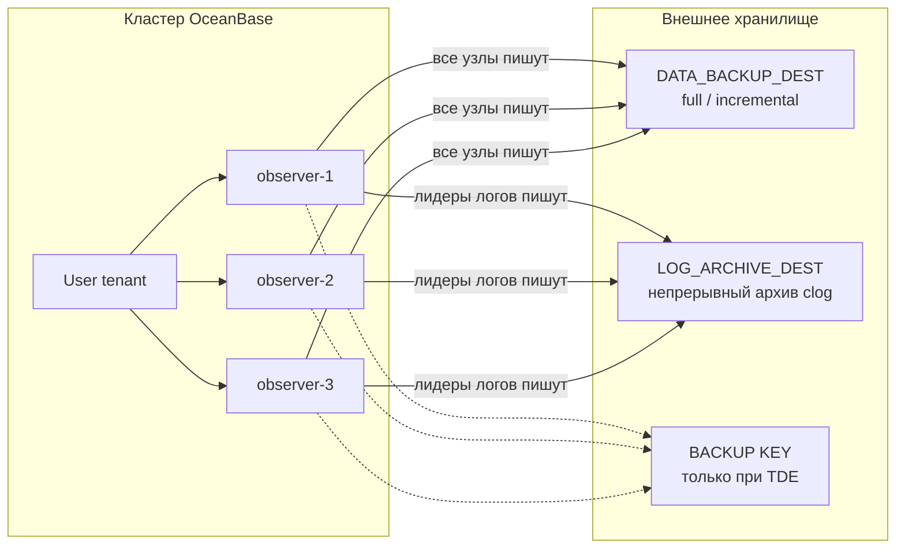

# Физический бэкап OceanBase: инфраструктура и режимы

Краткий обзор официальной документации OceanBase V4.x / V5.0 (этот репозиторий ставит **oceanbase-ce 5.0.1**). Документ отвечает: **что нужно снаружи кластера** для хранения копий, **какие режимы** доступны, **кто планирует** регулярный data backup, **как часто** архивируются логи и **как крутить скорость backup/restore**, не забивая прод и S3. Пошаговые SQL-рецепты эксплуатации сюда не входят — только инфраструктурные следствия и официальные рычаги производительности.

Разовые команды бэкапа, архива и restore — `./scripts/deploy.sh backup`, `archive-log` и `restore` (профиль `backup` в `config/deploy.yaml`). Расписание в observer по-прежнему не встроено. Диски observer (`network-ssd-nonreplicated` для data/log) **не заменяют** резервные копии: при потере majority официальный путь — physical backup/restore, а не замена узла. См. [node-recovery.md](node-recovery.md).

## Краткий ответ

| Вопрос | Ответ |
|--------|--------|
| Где хранить копии | **Вне кластера.** Отдельный NFS 4.1+ или объектное хранилище (OSS / AWS S3 / S3-совместимое / Azure Blob). На дисках observer бэкапы не живут |
| Что копируется | Только **user-тенанты**. `sys` и Meta не бэкапятся |
| Из чего состоит копия | Два независимых назначения: **data backup** + **log archive**. Для PITR нужны оба |
| Режимы данных | Полный (`FULL`) и инкрементальный (`INCREMENTAL`); опция `PLUS ARCHIVELOG` даёт самодостаточный набор |
| Режимы архива | `BINDING=Optional` (бизнес важнее, риск разрыва архива) и `Mandatory` (архив важнее, риск блокировки записи) |
| Режимы восстановления | Тенант целиком или таблица; полное или быстрое; до текущего конца архива или до SCN/времени |
| Регулярный data backup | В самом observer **нет** cron. Расписание — OCP, ob-operator, внешний cron/`obd`/`obshell` |
| Как часто архивируются логи | Непрерывно после `ARCHIVELOG`. Выгрузка не реже чем раз в **`archive_lag_target` (по умолчанию 120 с)** на каждый лог-стрим с записью; piece режется раз в **1–7 суток** (по умолчанию 1 день) |
| Скорость backup/restore | Сначала канал и dest, потом параллелизм: backup — `ha_low_thread_score` (дефолт 2), restore — `ha_high_thread_score` / `RESTORE … concurrency` |
| Не мешать проду | Backup — очередь `ha_low`; сеть — `sys_bkgd_net_percentage` (дефолт 60 % NIC); CPU/IOPS — Resource Manager `FUNCTION HA_LOW` |
| Лимит S3 | Да, на объектном dest: `max_iops` и `max_bandwidth` через `CHANGE EXTERNAL_STORAGE_DEST`. На NFS этих ручек нет |
| Для Yandex Cloud | Предпочтительно **Object Storage** (`s3://`). NFS «на все observer сразу» в трёх зонах штатно не закрывается File Storage |



## Что копируется

Физический бэкап OceanBase — это **тенантный** механизм из двух потоков:

1. **Резервная копия данных** — макроблоки таблиц user-тенанта, метаданные тенанта (имя, кластер, zone, locality, режим MySQL/Oracle), системные переменные и (с 4.2.1 BP10) тенантные параметры. Кластерные параметры и приватные системные таблицы **не** входят в обычный data backup.
2. **Архив журналов** — периодическая выгрузка clog на внешний путь. Запускается один раз (`ALTER SYSTEM ARCHIVELOG`) и дальше идёт сама, без cron.

Порядок обязательный: сначала архив в статусе `DOING`, потом data backup. Без архива полный бэкап не стартует.

Восстановление в V4.x/V5.x создаёт **новый** тенант (по умолчанию в роли standby). Существующий тенант командой restore не перезаписывается.

## Режимы резервного копирования

### Данные: полный и инкрементальный

| Режим | Команда (идея) | Что попадает на носитель |
|-------|----------------|--------------------------|
| Полный | `ALTER SYSTEM BACKUP DATABASE` / `BACKUP TENANT` | Все макроблоки тенанта |
| Инкрементальный | `BACKUP INCREMENTAL DATABASE` / `BACKUP INCREMENTAL TENANT` | Макроблоки, изменённые после последнего полного **или** инкрементального набора |

Инкремент без предшествующего полного набора система сама превращает в полный. После апгрейда кластера с более старой major/BP-версии инкремент тоже требует нового полного набора.

Расписание data backup в observer **не встроено**: команда `BACKUP` — разовый job. Периодичность задают снаружи, см. [Регулярный запуск и частота архива](#регулярный-запуск-и-частота-архива). Типичная схема — редкий полный + частые инкременты + непрерывный архив.

### Данные: `PLUS ARCHIVELOG`

К полной копии можно добавить `PLUS ARCHIVELOG`. В каталог data backup дополнительно кладётся срез архива, достаточный, чтобы восстановить тенант до `MIN_RESTORE_SCN` **без** отдельного `LOG_ARCHIVE_DEST`. Это удобно для «съёмного» набора и для создания standby в Community Edition, но не заменяет непрерывный архив, если нужен произвольный PITR между копиями.

### Архив: приоритет относительно бизнеса (`BINDING`)

Задаётся в `LOG_ARCHIVE_DEST`:

| Режим | Смысл | Инфраструктурный риск |
|-------|--------|------------------------|
| **Optional** (по умолчанию) | Сначала пользовательская запись. Если архив отстаёт, clog может уйти в recycle до выгрузки | Разрыв архивного потока, дыра в PITR |
| **Mandatory** | Сначала архив. Если носитель/сеть не успевают, запись в тенант может остановиться | Простой OLTP при деградации NFS/S3/NAT |

Для продакшена с Mandatory носитель и канал до него должны выдерживать пиковый поток clog (оценка: пиковый TPS × средний объём изменения × коэффициент записи логов, обычно 2–10, опытная 4). Для Optional достаточно «в среднем успевать», но тогда нужен запас по `archive_lag_target` и мониторинг отставания. Сама частота выгрузки — ниже, в [частоте архива](#как-часто-архивируются-логи).

### Кто инициирует и откуда

| Ось | Варианты |
|-----|----------|
| Область | Весь кластер (`BACKUP DATABASE`) или один/несколько user-тенантов |
| Кто запускает | `root@sys` или администратор user-тенанта |
| Источник | Основной тенант или **физический standby** (в V4.x standby backup/archive поддерживаются) |
| Шифрование набора | Опционально `SET ENCRYPTION ON IDENTIFIED BY '…' ONLY` до старта backup; пароль потом обязателен на restore и не снимается |
| TDE | Отдельный `ALTER SYSTEM BACKUP KEY … TO '…'` на **другой** путь, не data и не archive |

### Восстановление (чтобы понимать ёмкость и доступ)

| Режим | Поведение | Что должно быть на инфраструктуре |
|-------|-----------|-----------------------------------|
| Тенант, полное | Макроблоки + логи на целевые observer, потом сервис | Целевой кластер с resource pool, место на data/log дисках, доступ **всех** unit-узлов к обоим URI |
| Тенант, быстрое (`quick`) | Сервис без полной выгрузки макроблоков | Backup dest остаётся **онлайн** всё время жизни такого тенанта; NFS нельзя размонтировать. Тенант только standby: нет merge, нет backup, нет switchover/failover в primary |
| PITR | `UNTIL TIME` / SCN; без `UNTIL` — до конца доступного архива | Архив должен покрывать окно; MySQL-время режется до микросекунд |
| Таблица | В **уже существующий** тенант (с 4.2.1); тот же / другой тенант / другой кластер | Временный AUX-тенант + запас CPU/RAM/временного места под индексы |

После полного restore тенант в V4.x/V5.x — standby. Чтобы отдать его клиентам как primary, нужен отдельный promote/switchover, не «просто restore».

### Очистка

Автоочистка: `ALTER SYSTEM ADD DELETE BACKUP POLICY = 'default' RECOVERY_WINDOW = '…'`. Окно задаёт, как далеко назад должен быть достижим PITR; без `RECOVERY_WINDOW` наборы не протухают. Политика `log_only` — только архив, без data dest.

На объектном хранилище `delete_mode`:

- `delete` — OceanBase сам удаляет объекты;
- `tagging` — ставит тег, дальше lifecycle на стороне бакета (удобно с WORM / Object Lock).

Сменившийся URI автоочистка **не** трогает: старый префикс остаётся на носителе, пока его не снесут вручную. Заданная политика `default` / `log_only` **каждый час** порождает задачу очистки.

## Регулярный запуск и частота архива

Два разных механизма. Архив логов — фоновый процесс observer. Полный/инкрементальный data backup — разовая команда; «каждый день в 02:00» observer сам не сделает.

### Кто умеет крутить data backup по расписанию

| Механизм | Что даёт | Ограничение |
|----------|----------|-------------|
| **OCP** (в т.ч. Community: «新建租户级备份策略») | Политика на кластер или на тенант: период **неделя или месяц**, время суток, в выбранные дни `FULL_BACKUP` / `INCREMENTAL_BACKUP`, обязательный log backup, очистка, пороги алерта (таймаут data backup, задержка архива, дни без успешного backup) | Не cron с минутной сеткой. В месяце не больше 10 дней. Тенантная политика с V4.0 перекрывает кластерную. `sys` не бэкапится |
| **ob-operator** `OBTenantBackupPolicy` | Настоящий cron: `fullCrontab` / `incrementalCrontab` (пример из гайда: полный в сб 00:30, инкремент ежедневно 01:30). После создания политики сначала полный, дальше по cron | Этот репозиторий на ВМ + OBD, не Kubernetes |
| **OBD** `obd cluster tenant backup` | Разовый полный или `-m incremental` после `set-backup-config` | Планировщика нет — оборачивать cron/systemd |
| **obshell** `POST /api/v1/tenant/:name/backup` | То же: разовый `mode=full` / incremental | Планировщика нет |
| **SQL** `ALTER SYSTEM BACKUP …` | То же | Планировщика нет |
| **Внешний cron** | `obclient` / OBD / obshell по crontab ОС на jump host | Нужны учётные данные, идемпотентность, алерт если job не `COMPLETED` |

Официальной «дефолтной периодичности» полного бэкапа нет: выбирают окно хранения и RTO. Практичный шаблон из примеров operator/OCP — **полный раз в неделю, инкремент раз в сутки**, архив непрерывно.

Скрипты этого репозитория расписание не ставят: `backup` / `archive-log` / `restore` — разовые job. Если включён OCP ([ocp-deployment.md](ocp-deployment.md)) — это штатный планировщик для данной схемы (ВМ, не k8s). Иначе — cron вокруг `./scripts/deploy.sh backup`.

## Скрипты: archive-log, backup и restore

Профиль — секция **`backup`** в `config/deploy.yaml` (копия из `deploy.yaml.example`). Обязательные поля S3 проверяются **до** SQL: нет `host` / `bucket` / `access_id` / `access_key` — сразу ошибка. Ключи можно не класть в yaml, а задать `OB_BACKUP_S3_ACCESS_ID` и `OB_BACKUP_S3_ACCESS_KEY` (плюс `OB_BACKUP_S3_HOST` / `OB_BACKUP_S3_BUCKET`).

Тенант: `backup.tenant`, иначе `tenant.tenant_name`, иначе `--tenant`. Префиксы по умолчанию `backup/{tenant}/data` и `backup/{tenant}/archive` — у каждого тенанта свой путь, как требует документация.

```bash
# заполнить backup.s3 в config/deploy.yaml, egress observer → Object Storage
./scripts/deploy.sh backup validate          # только профиль, без кластера
./scripts/deploy.sh archive-log on           # SET LOG_ARCHIVE_DEST + ARCHIVELOG, ждать DOING
./scripts/deploy.sh backup full              # SET DATA_BACKUP_DEST + BACKUP TENANT
./scripts/deploy.sh backup incremental
./scripts/deploy.sh archive-log off          # NOARCHIVELOG; S3 не нужен
./scripts/deploy.sh backup show
```

`on` и `full`/`incremental` требуют полный `backup.s3`. `off` — только имя тенанта. Перед data backup архив должен быть `STATUS=DOING` (официальный порядок). `--no-wait` не ждёт COMPLETED/DOING; `--plus-archivelog` и профиль `backup.plus_archivelog` — только для `full` (`backup incremental` PLUS не добавляет). Скрипт ждёт конец job по **активным + history** views: завершённый backup исчезает из `CDB_OB_BACKUP_JOBS` и остаётся в `CDB_OB_BACKUP_JOB_HISTORY` (`COMPLETED`); restore в `CDB_OB_RESTORE_HISTORY` имеет `STATUS=SUCCESS`, не `RESTORE_SUCCESS`.

### Restore из того же dest

Официальный `ALTER SYSTEM RESTORE` создаёт **новый** тенант в роли standby и **не** перезаписывает живой. Обязателен существующий пустой resource pool (`backup.restore.pool_list` или `--pool`). Dest по умолчанию `{tenant}_restore` (чтобы не столкнуться с живым исходным). Пустые S3 или `pool_list` — сразу ошибка, без SQL.

Создание ресурсного пула:

```sql
CREATE RESOURCE UNIT tpcc_unit
  MAX_CPU 27, MIN_CPU 27,
  MEMORY_SIZE '78G',
  LOG_DISK_SIZE '400G';
  
CREATE RESOURCE POOL tpcc_pool
  UNIT = 'tpcc_unit',
  UNIT_NUM = 7,
  ZONE_LIST = ('zone1','zone2','zone3');
```

Команды восстановления:

```bash
# CREATE RESOURCE UNIT / POOL заранее; pool не должен быть занят другим тенантом
./scripts/deploy.sh restore validate
./scripts/deploy.sh restore                              # dest = {tenant}_restore
./scripts/deploy.sh restore run --dest-tenant tpcc --pool tpcc_pool   # то же имя после DROP
./scripts/deploy.sh restore run --dest-tenant tpcc_restore --pool restore_pool
./scripts/deploy.sh restore run --until-time '2026-09-16 12:00:00'
./scripts/deploy.sh restore run --activate               # ACTIVATE в том же run после успеха
./scripts/deploy.sh restore activate --dest-tenant tpcc   # если restore уже прошёл без --activate
./scripts/deploy.sh restore show
```

`--activate` / `backup.restore.activate: true` в `run` после успеха выполняет `ALTER SYSTEM ACTIVATE STANDBY TENANT`. Если restore уже закончился без этого флага — отдельно `./scripts/deploy.sh restore activate --dest-tenant …` (S3 и pool не нужны; dest должен быть STANDBY, restore не должен идти в `CDB_OB_RESTORE_PROGRESS`). Повторный `restore run --activate` нельзя: dest уже существует. Для `method=quick` activate в `run` запрещён: такой тенант остаётся standby, пока dest онлайн. `--until-time` и `--until-scn` вместе задавать нельзя. `run` отказывается, если dest уже есть в `DBA_OB_TENANTS` или pool занят. `--concurrency` / `backup.restore.concurrency` попадает в `WITH` (дефолт OceanBase = `MAX_CPU` dest-тенанта). Параллелизм restore после старта job — [производительность](#производительность-backup-и-restore).

### Как часто архивируются логи

После `ALTER SYSTEM ARCHIVELOG` и статуса `DOING` cron не нужен: каждый лог-стрим архивирует **лидер** этого стрима, RS leader только сводит `checkpoint_scn` тенанта.

Три разных часов — их путают:

| Часы | Параметр | По умолчанию | Что это |
|------|----------|--------------|---------|
| Выгрузка на носитель (RPO архива) | тенантный `archive_lag_target` | **120 с** (диапазон 0 … 7200 с) | **Максимальный** интервал между двумя archive IO **на лог-стрим, где есть новые логи**. Если агрегатный buffer заполнен раньше — выгрузка раньше. `0` ≈ «почти realtime» |
| Нарезка каталогов | `PIECE_SWITCH_INTERVAL` в `LOG_ARCHIVE_DEST` | **1d**, допустимо 1d…7d | Календарный кусок архива (piece), удобный для очистки. Не интервал выгрузки |
| Раунд архива | пока режим `ARCHIVELOG` | пока не `STOP` | Непрерывный поток; новый round — после останова/перезапуска архива |

Следствия:

- При равномерной записи ждите выгрузку **примерно каждые 2 минуты** на стрим, не «раз в сутки вместе с full backup».
- Тихий стрим без новых логов не обязан стучаться в dest каждые 120 с.
- Для **S3 и S3-совместимых** `archive_lag_target` **нельзя ставить ниже 60 с** (система отвергнет). NFS/OSS — любое значение из диапазона, включая 0.
- Слишком маленькое значение на объектном хранилище даёт частые мелкие Put и бьёт по цене/IOPS dest; слишком большое увеличивает RPO и в Optional повышает шанс, что clog уйдёт в recycle до выгрузки.
- Официальный совет: при выбранном лаге на стрим за период должно набегать **не меньше одного файла ~64 МБ** (архивный файл изоморфен clog). Если TPS низкий, уменьшать лаг до секунд обычно бессмысленно.
- Для standby на архиве лаг на primary ставят примерно в **половину** допустимой задержки standby.

Проверка: `CDB_OB_ARCHIVELOG` / `DBA_OB_ARCHIVELOG`, поле `STATUS=DOING`; отставание `checkpoint_scn` в спокойном режиме должно быть порядка `archive_lag_target`. Если отставание стабильно больше — узкое место dest/сеть, не «расписание».

## Что предусмотреть на инфраструктуре

Бэкап пишет **сами observer**, не OBD и не отдельный агент. Значит, канал и учётные данные должны быть у **каждого** узла с unit’ами тенанта. Новый observer в scale-out / `--replace` без доступа к dest либо не стартует архив, либо ломает backup.

### 1. Отдельный носитель, не диски кластера

Нужны **два пустых независимых пути на тенант**: `DATA_BACKUP_DEST` и `LOG_ARCHIVE_DEST`. Общий каталог на двоих и общий каталог на два тенанта — ошибка конфигурации.

Ёмкость грубо:

```
полный набор × число хранимых full
+ инкременты между full
+ архив за RECOVERY_WINDOW
+ (если TDE) ключи
```

В V4.x на время backup snapshot на data-дисках observer **не** удерживается, локальные диски из‑за бэкапа не «раздуваются». Размер файлов data backup — крупные объекты (порядка 512 МБ … 4 ГБ на макрофайл), архив — файлы, изоморфные clog (~64 МБ и больше), не миллионы мелких файлов как в 2.x/3.x.

Перед выбором носителя официально советуют прогнать `ob_admin test_io_device` (совместимость API/прав) и `ob_admin io_adapter_benchmark` (скорость observer → dest).

### 2. Объектное хранилище (рекомендуемый dest)

Официально предпочтительнее NFS: нет клиентских file lock, нет hang всего observer при обрыве mount.

Поддерживаемые схемы URI в 5.0.1:

| Схема | Носитель |
|-------|----------|
| `oss://` | Alibaba Cloud OSS |
| `s3://` | AWS S3 и S3-совместимые (Huawei OBS, Google GCS, Tencent COS, …) |
| `azblob://` | Azure Blob |
| `file://` | NFS |

Для S3-совместимого бакета dest должен уметь как минимум: `PutObject`, `GetObject`, `HeadObject`, `DeleteObject` / `DeleteObjects`, `ListObjects`, multipart (`Create/Upload/Complete/Abort`, `ListMultipartUploads`, `ListParts`). Теги объектов — опционально, но нужны для `delete_mode=tagging`.

Инфраструктурный чеклист:

- бакет и **отдельные префиксы** `…/data` и `…/archive` на каждый тенант;
- статический ключ (`access_id` / `access_key`); в URI допустимы только `[A-Za-z0-9/_$+=]` и wildcard — сложный секрет с прочими символами ломает `SET DATA_BACKUP_DEST`;
- HTTPS с **каждого** observer до endpoint (см. сеть ниже);
- стиль URL: по умолчанию virtual-hosted (`bucket.host/key`); если провайдер так не умеет — `addressing_model=path_style`;
- checksum: для S3-совместимых обычно `md5` (обязателен, `no_checksum` SDK не даёт);
- при ошибках 9129/9026 — кластерный `ob_storage_s3_url_encode_type = compliantRfc3986Encoding`;
- immutable/WORM на бакете: OceanBase сам политику не включает; в URI нужно `enable_worm=true` и лучше `delete_mode=tagging`.

### 3. NFS (если объектное хранилище нельзя)

Официальные жёсткие условия:

- **один и тот же** NFS на **всех** observer;
- протокол **4.1+** (backup опирается на file lock NFSv4; у 4.0 известен баг rename);
- сначала mount, потом archive/backup; при аварии NFS — **сначала** остановить backup и archive, потом чинить;
- при рестарте узла: сначала NFS, потом `observer`;
- при добавлении машины: mount (или другой dest) **до** старта `observer`;
- софт-NFS на обычной ВМ считают нестабильным (hang → клинит backup и сам узел); предпочтительны выделенные NFS-appliance, диск dest — SSD;
- Docker/K8s: mount на хосте, в контейнер — bind; прямой mount из контейнера даёт hung.

Обязательные опции клиента (`nfsvers=4.1`, `sync`, `lookupcache=positive`, `hard` — **не** `soft`):

```text
rw,nfsvers=4.1,sync,lookupcache=positive,hard,timeo=600,wsize=1048576,rsize=1048576,namlen=255
```

На сервере и клиентах рекомендуют `sunrpc.tcp_max_slot_table_entries=128`. Путь в `file://` — абсолютный, без `?` в самом LOCATION. Права записи — у процесса observer на каждом узле.

### 4. Сеть, egress, лимиты

| Что | Зачем |
|-----|--------|
| Связность observer → dest с **каждой** зоны | Архив пишет лидер лог-стрима (он может быть в любой zone); data backup выбирает узлы, опционально сужая набор через `?zone=` / `idc=` / `region=` |
| Запас ширины канала | Полный backup — пачка; архив — постоянный поток. Фоновые задачи по умолчанию режутся `sys_bkgd_net_percentage` (**60 %** от распознанной скорости NIC). Кнопки и порядок тюнинга — [производительность](#производительность-backup-и-restore) |
| Не делить saturating-путь с OLTP | Backup классифицируется как `ha_low`; CPU/IOPS можно ограничить Resource Manager. Restore — уже `ha_high` |
| Стабильный DNS/TLS до S3 | Иначе Mandatory остановит запись, Optional порвёт архив |

Сужение источника (`zone` / `idc` / `region` в URI) имеет смысл, если в одной IDC больше канала до бакета. Для архива это не «приоритет», а **ограничение**: лидер лог-стрима обязан быть в указанном наборе, иначе архив не двигается. Root Service leader должен попадать в набор для data backup, иначе метаданные набора не пишутся.

### 5. Целевой контур восстановления

Restore читает те же URI **с целевых** observer. Нужно заранее:

- кластер (тот же или другой) с пустым resource pool достаточной ёмкости (CPU/RAM/data/log);
- те же сетевые правила до dest;
- при быстром restore — dest, который не планируют отключать;
- хранение пароля набора и TDE-ключа вне бакета с данными.

RTO полного restore определяется сетью dest → observer и параллелизмом (`ha_high_thread_score`, `RESTORE … concurrency`, `log_restore_concurrency`), не скоростью локального SSD кластера. Подробности — [производительность](#производительность-backup-и-restore).

### 6. Эксплуатационные зависимости

- **Время.** Метки наборов и PITR завязаны на часы узлов; в этом репозитории chrony уже ставится на `prepare`.
- **Политика хранения.** `RECOVERY_WINDOW` + lifecycle бакета; иначе archive+full растут неограниченно.
- **Оркестрация data backup.** Observer сам не планирует. OCP (неделя/месяц), ob-operator (cron), либо внешний cron вокруг OBD/SQL/obshell. Подробности — [регулярный запуск](#регулярный-запуск-и-частота-архива).
- **Проверка носителя** до первого `ARCHIVELOG`, не после падения Mandatory.

## Производительность backup и restore

Официальная постановка: в идеале скорость упирается только в **распределение данных** (число и размер партиций) и **железо** (CPU, диск, сеть до dest). Дефолты этот потолок не берут. Сначала убеждаются, что CPU/IO/сеть не в потолке (в том числе из‑за Resource Manager), и только потом крутят параллелизм.

[oceanbase-skills](https://github.com/oceanbase/oceanbase-skills) (`tenant-management` → [backup-restore.md](https://github.com/oceanbase/oceanbase-skills/blob/master/skills/oceanbase-deploy/tenant-management/references/backup-restore.md)) рычагов производительности не задают: там workflow OBD и требование **проверить throughput с каждого observer**, который будет писать/читать dest. Числа ниже — из [备份恢复性能调优](https://www.oceanbase.com/docs/common-oceanbase-database-cn-1000000005681984) (V4.3/V4.6, те же рычаги в V5.0.1) и [CHANGE EXTERNAL_STORAGE_DEST](https://www.oceanbase.com/docs/common-oceanbase-database-cn-1000000006619414) (V5.0.1).

### Как обеспечить скорость на большом кластере

Пишут **сами observer с unit’ами тенанта**, не отдельный агент. Больше узлов с данными тенанта — больше писателей; узкое место почти всегда **канал observer → dest**, не локальный SSD.

Порядок:

1. **Измерить dest** с observer: `ob_admin test_io_device` (API/права) и `ob_admin io_adapter_benchmark` (МБ/с, QPS, латентность). Если бенчмарк не даёт нужный RTO — параллелизм внутри OceanBase не поможет.
2. **Проверить, какую NIC видит observer.** Лимит фона = распознанная скорость × `sys_bkgd_net_percentage` (дефолт 60 %). Смотреть `oceanbase.V$OB_NIC_INFO` и лог `init_bandwidth_throttle`. Если цифра занижена (типично в облаке) — `{home_path}/etc/nic.rate.config` вида `eth0=10000` (Mbps). Иначе «60 %» режет backup по фантомным 1 Gbit.
3. **Снять искусственный потолок Resource Manager**, если он уже стоит на `HA_LOW` / `HA_HIGH` (`DBA_OB_RSRC_DIRECTIVES` / `DBA_OB_RSRC_IO_DIRECTIVES`). На перф-тестах backup/restore официально **не** включают изоляцию.
4. **Поднять параллелизм**, когда CPU/IO/сеть ещё есть.

| Рычаг | Что крутит | Дефолт | Как на большом кластере |
|-------|------------|--------|-------------------------|
| `ha_low_thread_score` | data backup (и очистка копий) | `0` → **2** потока, диапазон 0…100 | Тенант ≤ 4 CPU — не трогать. Крупный — начать с **10**, если медленно — удваивать. Перф-тест: до 100 |
| `log_archive_concurrency` | архив clog | `0` = от `MAX_CPU`: ≤8 → `MAX_CPU`; 8…32 → `max(8, MAX_CPU/2)`; ≥32 → `max(16, MAX_CPU/4)` | Оставить `0` |
| `RESTORE … WITH '…&concurrency=N'` | data restore в момент старта | = `MAX_CPU` dest-unit | Запас CPU в **целевом** pool; скрипт: `--concurrency` / `backup.restore.concurrency` |
| `ha_high_thread_score` | data restore (очередь HA high) | `0` → **8** | После `META$…` в `NORMAL` — **10**; перф-тест — до 100. Не путать с backup |
| `log_restore_concurrency` | log restore / догон standby | `0` → `MAX_CPU` | Держать `0`. Поднимать только если фаза логов отстаёт **и** канал dest не забит; на NFS часто хватает 5 |
| `_restore_idle_time` | скрытый интервал планировщика RS | 1 мин | Имеет смысл на мелких тенантах (≤ 4 CPU): 10 с экономят десятки секунд…2 мин, на крупных почти не видно |

Источник backup на большом кластере сужают до IDC с **широким** каналом до бакета (`?idc=` / `zone=` / `region=` в dest; запятая = один приоритет, точка с запятой = приоритет слева выше). Рекомендуют уровень **IDC**, не список zone: больше кандидатов-узлов, меньше возни при смене topology. Root Service leader обязан быть в этом наборе, иначе metadata backup не пишется. Для архива это не «приоритет», а **фильтр**: лидер лог-стрима вне набора — архив стоит.

Restore на большом объёме:

- целевой pool с достаточным `MAX_CPU` (это дефолтный `concurrency`);
- все **целевые** observer читают те же URI;
- после появления Meta-тенанта `META$…` со статусом `NORMAL` — `ha_high_thread_score = 10` на **восстанавливаемый** тенант;
- `method=quick` быстрее полного, но dest обязан оставаться онлайн всё время жизни такого standby;
- RTO полного restore ≈ сеть dest → observer × параллелизм, не IOPS data-диска.

Не бэкапить все user-тенанты одним `BACKUP DATABASE` на пике: каждый тенант — свой job и свой поток на dest.

### Как ограничить воздействие на прод

Backup и очистка копий идут в очередь **`ha_low`** (низкий приоритет HA). Restore, copy и rebuild — **`ha_high`**. Restore **в тот же** продуктивный кластер конкурирует с HA на высоком приоритете; для RTO большого тенанта лучше отдельный контур.

Рычаги изоляции (от грубого к точному):

| Что режем | Рычаг | Замечание |
|-----------|--------|-----------|
| Доля NIC на **все** фоновые задачи (backup, restore, migrate, copy) | кластерный `sys_bkgd_net_percentage` (0…100, дефолт **60**, сразу, без рестарта; меняет только `sys`) | Режет и restore. Слишком низко — backup не успевает в окно; слишком высоко — OLTP на том же NIC |
| CPU / IOPS backup | Resource Manager: `SET_CONSUMER_GROUP_MAPPING('FUNCTION','HA_LOW', …)` | CPU-изоляция нужна cgroup. Restore мапится на `HA_HIGH` — **другая** группа |
| Кто пишет backup | `zone` / `idc` / `region` в dest | Сдвиг нагрузки в IDC с запасом канала, остальные zone оставляют OLTP |
| Когда полный backup | внешний cron / OCP | Observer сам расписания не ставит |
| Архив vs запись | `BINDING=Optional` | Optional не душит OLTP при деградации dest, но дырявит PITR. Mandatory при узком S3 остановит запись |

Не разгонять `ha_low_thread_score` на тенантах ≤ 4 CPU. Если изоляция уже стоит и backup упёрся ровно в её MAX_IOPS/CPU — сначала поднять потолок группы, не поток нитей: иначе очередь растёт, а IO уже на квоте.

Полный backup лучше не делить saturating-путь с OLTP (тот же NIC без запаса, тот же NAT). Архив — постоянный фон; его RPO задаёт `archive_lag_target`, не «ночное окно».

### Можно ли ограничить запросы и трафик в S3?

**Да, на объектном dest (S3/OSS/совместимые). На NFS — нет** (ошибка `1235`).

После того как путь уже задан (`DATA_BACKUP_DEST` / `LOG_ARCHIVE_DEST`), с **user-тенанта**:

```sql
ALTER SYSTEM CHANGE EXTERNAL_STORAGE_DEST
  PATH = 's3://<bucket>/backup/<tenant>/data?host=storage.yandexcloud.net'
  SET ATTRIBUTE = 'max_iops=500&max_bandwidth=100mb';
```

То же для archive-префикса: data и archive — **разные** пути, лимит на одном не душит другой.

| Параметр | Смысл | Если не задан |
|----------|--------|----------------|
| `max_iops` | потолок I/O-запросов в секунду **на этот путь** | без лимита, сколько выдержит бакет/сеть |
| `max_bandwidth` | потолок полосы; единицы `kb` / `mb` / `gb` = KB/s / MB/s / GB/s | без лимита |

Официальный совет для шумного мультиtenant: начать с **`max_iops=500&max_bandwidth=100mb`**, смотреть длительность backup и пик OLTP, потом поднимать. В URI при `SET DATA_BACKUP_DEST` этих полей нет — только `CHANGE`/`MODIFY`/`ALTER EXTERNAL_STORAGE_DEST`. PATH обязан содержать `host`. Текущие значения: `CDB_OB_BACKUP_STORAGE_INFO` / `DBA_OB_BACKUP_STORAGE_INFO` (`MAX_IOPS`, `MAX_BANDWIDTH`).

Что это **не** умеет:

- нет отдельного «S3 QPS SDK»; клиент держит до **512** соединений на процесс — это потолок пула, не лимит. HTTP 429 / SlowDown SDK **ретраит**, а не режет заранее;
- `sys_bkgd_net_percentage` режет суммарный фон observer (включая не-S3 HA), не бакет;
- Resource Manager режет CPU/IOPS на стороне observer, не API бакета;
- квоты Yandex Object Storage / NAT остаются снаружи и могут рвать backup независимо от `max_*`.

Мелкие частые Put архива на S3 отдельно бьют по IOPS: `archive_lag_target` **нельзя** ставить ниже **60 с**; ещё меньше — больше мелких объектов и цена/лимиты бакета при том же RPO.

Итого три слоя, их можно сочетать: **путь** (`max_iops`/`max_bandwidth`) → **NIC фона** (`sys_bkgd_net_percentage`) → **CPU/диск backup** (Resource Manager `HA_LOW`).

## Следствия для этого репозитория (Yandex Cloud)

Кластер по умолчанию — **3 observer в трёх зонах**, у ВМ часто **нет NAT** (`yandex_cloud.nat_enabled: false`). Бэкап к этому не цепляется сам.

**Object Storage** — основной кандидат: кросс-AZ, S3 API, URI вида `s3://<bucket>/…`. Нужно отдельно:

1. Бакет (лучше Standard; проверить List/multipart/tagging, если планируется `tagging`).
2. Статический ключ сервисного аккаунта с правом на префиксы тенантов.
3. **Egress с приватных observer:** NAT-шлюз в VPC **или** сервисный endpoint Object Storage. Иначе `s3://` с `nat_enabled: false` просто не достучится до `storage.yandexcloud.net`.
4. Security group / ACL: исходящие HTTPS (443) с observer до endpoint.
5. В URI: `host=storage.yandexcloud.net`, при необходимости `addressing_model=path_style`, `checksum_type=md5`. Совместимость S3 API стоит подтвердить `test_io_device` на одном observer до включения архива.
6. Префиксы не пересекать между тенантами и между data/archive.

**NFS в трёх зонах** официальному требованию «все observer на одном NFS» почти не удовлетворяет штатными сервисами YC:

- [File Storage](https://yandex.cloud/docs/compute/concepts/filesystem) — virtiofs, **только одна AZ**, к трёхзонному кластеру не подключается;
- NFS на одной ВМ — как раз тот software-NFS, от которого OceanBase предостерегает, плюс единая точка отказа и AZ-affinity.

Если всё же NFS: выделенный appliance/кластер с NFSv4.1, доступный из всех трёх подсетей observer, SSD, опции mount как выше, автомонтирование в fstab/systemd **до** observer, и отдельная процедура в [node-recovery.md](node-recovery.md) / scale-out: новый узел не стартовать без mount.

Дополнительные мелочи YC: квоты на бакет и NAT, шифрование бакета на стороне YC не отменяет `BACKUP KEY` для TDE внутри OceanBase, Object Lock близок к сценарию `enable_worm` + `tagging` (проверять, а не предполагать).

Скорость и изоляция в этой схеме:

- egress часто идёт через **NAT** — его полоса общий потолок на все observer зоны, `max_bandwidth` на dest его не расширит;
- три AZ пишут backup параллельно, пока dest не сужен `idc=`/`zone=`; архив всё равно пишет лидер стрима из любой zone;
- `V$OB_NIC_INFO` в облаке часто не совпадает с лимитом ВМ — сверить `{home_path}/etc/nic.rate.config` с профилем, иначе 60 % фона считается от «не той» NIC;
- квоты Object Storage (запросы/с, полоса) лучше заранее согласовать с `max_iops`/`max_bandwidth`, иначе OceanBase получит 429 и будет ретраить.

## Минимальный чеклист перед первым `ARCHIVELOG`

- [ ] Носитель выбран, ёмкость ≥ full + incrementals + архив за окно хранения
- [ ] Два пустых URI на каждый user-тенант (+ третий, если TDE)
- [ ] С **каждого** текущего и будущего observer есть запись на dest
- [ ] Для S3: ключи, TLS, стиль URL, `test_io_device`
- [ ] Для NFS: 4.1, одни опции mount, autofs/fstab, порядок «NFS → observer»
- [ ] Выбран `BINDING` исходя из того, готовы ли пожертвовать записью или PITR
- [ ] Задан `archive_lag_target` (дефолт 120 с; для S3 не ниже 60 с) — это RPO архива, не piece
- [ ] Есть планировщик data backup (OCP / cron / operator), observer сам full/inc не крутит
- [ ] Заданы `RECOVERY_WINDOW` / lifecycle, иначе хранилище не ограничено
- [ ] Целевой pool под restore и доступ к тем же URI с целевых узлов
- [ ] NAT/endpoint, если observer без публичного IP
- [ ] Скорость dest измерена `io_adapter_benchmark`; NIC в `V$OB_NIC_INFO` совпадает с фактом
- [ ] Для продакшена заданы изоляция (`sys_bkgd_net_percentage` / `HA_LOW` / `max_bandwidth`) и окно полного backup

## Источники

| Тема | Документ |
|------|----------|
| Обзор physical backup/restore, носители, отличия V3/V4 | [物理备份与恢复概述](https://www.oceanbase.com/docs/common-oceanbase-database-cn-1000000000218106) (V4.2.1); [standalone 4.3.5](https://www.oceanbase.com/docs/common-oceanbase-database-standalone-1000000003577392) |
| Подготовка data dest, раздельные пути, S3/OSS/NFS | [备份前准备](https://www.oceanbase.com/docs/common-oceanbase-database-cn-1000000006615585) (V5.0.1) |
| `DATA_BACKUP_DEST` | [SET DATA_BACKUP_DEST](https://www.oceanbase.com/docs/common-oceanbase-database-cn-1000000006619501) |
| `LOG_ARCHIVE_DEST`, `BINDING`, piece | [SET LOG_ARCHIVE_DEST](https://www.oceanbase.com/docs/common-oceanbase-database-cn-1000000004479704); [日志归档前准备](https://www.oceanbase.com/docs/common-oceanbase-database-cn-1000000006615620) (V5.0.1, в т.ч. `archive_lag_target`) |
| Организация архива, piece vs checkpoint | [日志归档概述](https://www.oceanbase.com/docs/common-oceanbase-database-cn-1000000006615618) |
| Полный backup, `PLUS ARCHIVELOG` | [发起全量数据备份](https://www.oceanbase.com/docs/common-oceanbase-database-cn-1000000006615588); [BACKUP](https://www.oceanbase.com/docs/common-oceanbase-database-cn-1000000000510892) |
| Инкремент | [发起增量数据备份](https://www.oceanbase.com/docs/common-oceanbase-database-cn-1000000000749376) |
| NFS: версия, hang, порядок старта | [部署 NFS](https://www.oceanbase.com/docs/common-oceanbase-database-cn-1000000001049949); [опции mount](https://www.oceanbase.com/knowledge-base/oceanbase-database-1000000000208040) |
| Сеть и параллелизм backup/restore | [备份恢复性能调优](https://www.oceanbase.com/docs/common-oceanbase-database-cn-1000000005681984); [sys_bkgd_net_percentage](https://www.oceanbase.com/docs/common-oceanbase-database-cn-1000000006618824) (V5.0.1); [ha_high_thread_score](https://www.oceanbase.com/docs/common-oceanbase-database-cn-1000000006618652) |
| Лимит IOPS/полосы объектного dest | [CHANGE EXTERNAL_STORAGE_DEST](https://www.oceanbase.com/docs/common-oceanbase-database-cn-1000000006619414) (`max_iops`, `max_bandwidth`) |
| Resource Manager: backup = `HA_LOW`, restore = `HA_HIGH` | [SET_CONSUMER_GROUP_MAPPING](https://www.oceanbase.com/docs/common-oceanbase-database-cn-1000000006619741); [конфигурация изоляции](https://www.oceanbase.com/docs/common-oceanbase-database-cn-1000000006619059) |
| Restore: `concurrency`, `ha_high_thread_score` после Meta | [执行物理恢复](https://www.oceanbase.com/docs/common-oceanbase-database-cn-1000000006615598); [физические параметры restore](https://www.oceanbase.com/docs/common-oceanbase-database-cn-1000000006615597) |
| Замер dest | [test_io_device](https://www.oceanbase.com/docs/common-oceanbase-database-cn-1000000003382066); [io_adapter_benchmark](https://www.oceanbase.com/docs/common-oceanbase-database-cn-1000000001502741) |
| `archive_lag_target` | [archive_lag_target](https://www.oceanbase.com/docs/common-oceanbase-database-cn-1000000005685334) |
| TDE-ключи | [BACKUP KEY](https://www.oceanbase.com/docs/common-oceanbase-database-cn-1000000006619504) |
| Очистка, `RECOVERY_WINDOW` | [自动清理过期备份](https://www.oceanbase.com/docs/common-oceanbase-database-cn-1000000006616111) |
| Restore тенанта / быстрый restore | [租户级物理恢复](https://www.oceanbase.com/docs/common-oceanbase-database-cn-1000000005282824) |
| ACTIVATE STANDBY после restore | [ACTIVATE STANDBY](https://www.oceanbase.com/docs/common-oceanbase-database-cn-1000000006619548) |
| OBD tenant backup (разовый) | [备份与恢复 (OBD)](https://www.oceanbase.com/docs/common-obd-cn-1000000006430654); [oceanbase-skills backup-restore](https://github.com/oceanbase/oceanbase-skills/blob/master/skills/oceanbase-deploy/tenant-management/references/backup-restore.md) |
| OCP расписание (неделя/месяц) | [新建租户级备份策略 (OCP CE)](https://www.oceanbase.com/docs/community-ocp-cn-1000000000261383); [API: создание политики](https://www.oceanbase.com/docs/common-ocp-1000000005296052) |
| ob-operator cron | [Back up a tenant](https://oceanbase.github.io/ob-operator/docs/manual/ob-operator-user-guide/high-availability/tenant-backup-of-ob-operator) |
| YC Object Storage S3 | [S3 API](https://yandex.cloud/docs/storage/s3/) |
| YC File Storage (не NFS, одна AZ) | [File storages](https://yandex.cloud/docs/compute/concepts/filesystem) |
