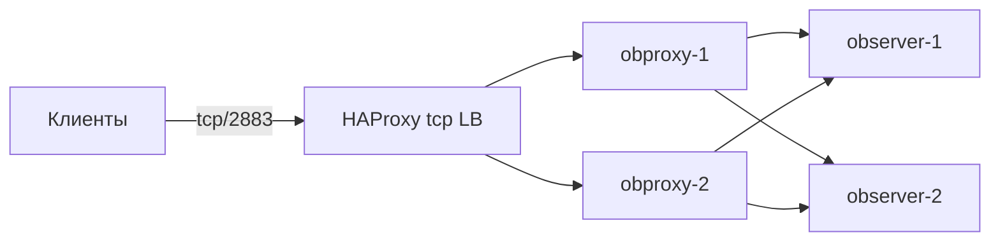

# Балансировка OBProxy через HAProxy (TCP, привязка соединений)

При `vm_profiles.obproxy.count > 1` клиентам нужна единая точка входа. **HAProxy** в режиме `tcp` проксирует соединения на порт **2883** (MySQL-протокол OceanBase) и распределяет **новые** TCP-сессии между несколькими ВМ obproxy.

## Схема



## Привязка на уровне соединений

В блоке `backend` используется:

```haproxy
balance source
```

- Каждое **новое** TCP-соединение с одного клиентского IP направляется на один и тот же obproxy.
- Пока соединение открыто, весь трафик идёт через выбранный backend (свойство TCP-прокси).
- HAProxy вычисляет хеш от IP источника и выбирает сервер из пула — поведение аналогично sticky sessions.

Альтернативы (меняйте осознанно):

| Директива | Поведение |
|-----------|-----------|
| `balance source` | Sticky по IP клиента (рекомендуется по умолчанию) |
| `balance leastconn` | Наименьшее число активных соединений, без sticky |
| `balance roundrobin` | Round-robin для новых соединений |

Для явной таблицы привязок (например, с TTL) можно использовать `stick-table` + `stick on src`, но для obproxy обычно достаточно `balance source`.

OBProxy stateless, но sticky по IP уменьшает «прыжки» между прокси при пуле коротких соединений и упрощает диагностику.

## Быстрая установка

1. Создайте лёгкую ВМ в той же подсети (или используйте jump host).
2. Скопируйте и отредактируйте пример:

```bash
sudo apt install -y haproxy
sudo cp config/haproxy-obproxy-tcp-lb.cfg.example /etc/haproxy/haproxy.cfg
```

3. Подставьте IP obproxy из `generated/inventory.env` (`OBPROXY_*_IP`).
4. Проверка и запуск:

```bash
sudo haproxy -c -f /etc/haproxy/haproxy.cfg
sudo systemctl enable --now haproxy
mysql -h<haproxy_lb_ip> -P2883 -uroot -p
```

## Health check

В примере включена TCP-проверка (`option tcp-check` + `check` на каждом `server`): HAProxy периодически устанавливает TCP-соединение на порт obproxy. При `fall 3` подряд неудачных проверок сервер исключается из ротации до `rise 2` успешных.

Для production с жёсткими SLA рассмотрите также Network Load Balancer Yandex Cloud с проверкой `tcp/2883`.

## См. также

- [config/haproxy-obproxy-tcp-lb.cfg.example](../config/haproxy-obproxy-tcp-lb.cfg.example) — готовый фрагмент конфигурации
- [README.md](../README.md) — развёртывание кластера и `vm_profiles.obproxy`
