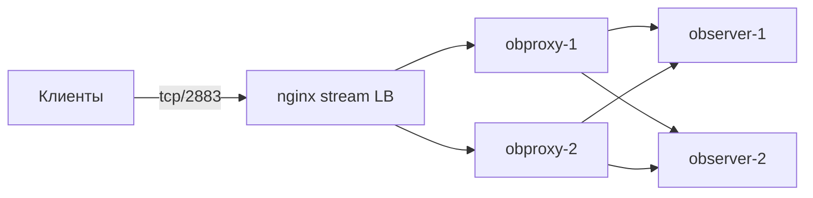

# Балансировка OBProxy через nginx (TCP, привязка соединений)

При `vm_profiles.obproxy.count > 1` клиентам нужна единая точка входа. **nginx** в режиме `stream` проксирует TCP на порт **2883** (MySQL-протокол OceanBase) и распределяет **новые** соединения между несколькими ВМ obproxy.

## Схема



## Привязка на уровне соединений

В блоке `upstream` используется директива:

```nginx
hash $remote_addr consistent;
```

- Каждый **новый** TCP-сессия с одного клиентского IP направляется на один и тот же obproxy.
- Пока соединение открыто, трафик идёт только через выбранный backend (это свойство TCP-прокси).
- `consistent` снижает перераспределение при изменении числа upstream-серверов по сравнению с простым `hash`.

Альтернативы (меняйте осознанно):

| Директива | Поведение |
|-----------|-----------|
| `hash $remote_addr consistent;` | Sticky по IP клиента (рекомендуется по умолчанию) |
| `least_conn;` | Наименьшее число активных соединений, без sticky |
| без hash / least_conn | Round-robin для новых соединений |

OBProxy stateless, но sticky по IP уменьшает «прыжки» между прокси при пуле коротких соединений и упрощает диагностику.

## Быстрая установка

1. Создайте лёгкую ВМ в той же подсети (или используйте jump host).
2. Скопируйте и отредактируйте пример:

```bash
sudo apt install -y nginx
sudo mkdir -p /etc/nginx/stream.d
sudo cp config/nginx-obproxy-tcp-lb.conf.example /etc/nginx/stream.d/obproxy.conf
```

3. Подставьте IP obproxy из `generated/inventory.env` (`OBPROXY_*_IP`).
4. В `/etc/nginx/nginx.conf` добавьте на верхнем уровне:

```nginx
stream {
    include /etc/nginx/stream.d/*.conf;
}
```

5. Проверка и перезагрузка:

```bash
sudo nginx -t && sudo systemctl enable --now nginx && sudo systemctl reload nginx
mysql -h<nginx_lb_ip> -P2883 -uroot -p
```

## Health check

В open-source nginx для `stream` доступны только **пассивные** проверки через `max_fails` / `fail_timeout` на `server`. При необходимости активных проверок рассмотрите отдельный health-check sidecar или Network Load Balancer Yandex Cloud с проверкой tcp/2883.

## См. также

- [config/nginx-obproxy-tcp-lb.conf.example](../config/nginx-obproxy-tcp-lb.conf.example) — готовый фрагмент конфигурации
- [README.md](../README.md) — развёртывание кластера и `vm_profiles.obproxy`
