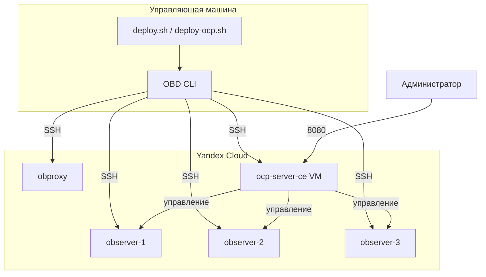

# Развёртывание OceanBase Cloud Platform (OCP)

[OceanBase Cloud Platform (OCP)](https://www.oceanbase.com/docs/ocp) — веб-консоль для управления кластером OceanBase: мониторинг, O&M, установка и масштабирование.

Скрипты этого репозитория разворачивают OCP на **отдельной виртуальной машине** в Yandex Cloud и устанавливают `ocp-server-ce` через [OBD](https://www.oceanbase.com/docs/common-obd-cn-1000000005246289) поверх уже развёрнутого кластера OceanBase.

## Архитектура



OCP использует мета-тенанты `ocp_meta` и `ocp_monitor` в кластере OceanBase. При integrated deploy OBD создаёт их автоматически на этапе `oceanbase-ce`.

## Требования

| Компонент | Назначение |
|-----------|------------|
| Отдельная ВМ OCP | 4+ vCPU, 16+ GB RAM (по умолчанию в `vm_profiles.ocp`) |
| Java 8+ в `/usr/bin/java` | Устанавливается скриптом `prepare-ocp-host.sh` |
| `clockdiff` | Пакет `iputils-clockdiff` (Ubuntu) |
| Кластер OceanBase | Минимум 3 observer + obproxy (как в основном сценарии) |
| OBD | Развёртывание `ocp-server-ce` |

## Быстрый старт

1. Скопируйте и отредактируйте конфигурацию:

```bash
cp config/deploy.yaml.example config/deploy.yaml
```

2. Включите OCP:

```yaml
vm_profiles:
  ocp:
    enabled: true
    count: 1
    cores: 4
    memory_gb: 16

ocp:
  enabled: true
  port: 8080
  admin_password: <secure-password>
  root_password: <oceanbase-root-password>
  proxyro_password: <proxyro-password>
```

3. Полное развёртывание (OceanBase + OCP):

```bash
./scripts/deploy.sh all
```

Или только OCP (если кластер OceanBase уже развёрнут):

```bash
./scripts/deploy-ocp.sh all
```

## Пошаговый режим

```bash
./scripts/deploy-ocp.sh check       # проверка профиля и зависимостей
./scripts/deploy-ocp.sh provision   # создание OCP-ВМ в YC
./scripts/deploy-ocp.sh prepare     # Java, clockdiff, диски
./scripts/deploy-ocp.sh config      # obd-cluster.yaml с ocp-server-ce
./scripts/deploy-ocp.sh deploy      # obd cluster deploy + start
```

Основной сценарий `./scripts/deploy.sh` при включённом OCP в config выполняет те же шаги в рамках `all`: provision создаёт все ВМ (включая OCP), prepare подготавливает OCP-ВМ, config и deploy добавляют `ocp-server-ce`.

## Профиль ВМ OCP

По умолчанию (`config/deploy.yaml.example`):

| Параметр | Значение | Назначение |
|----------|----------|------------|
| cores | 4 | Минимум для OCP server |
| memory_gb | 16 | JVM + OCP services |
| boot_disk | 50 GB io-m3 | ОС и бинарники |
| data_disk | 186 GB io-m3 | Пакеты (`soft_dir`), логи (`log_dir`) |

Проверка:

```bash
python3 scripts/lib/vm_profiles.py validate --config config/deploy.yaml
python3 scripts/lib/vm_profiles.py resolve ocp --config config/deploy.yaml --format json
```

## Параметры `ocp` в config

| Параметр | Описание |
|----------|----------|
| `enabled` | Включить развёртывание OCP |
| `port` | HTTP-порт веб-консоли (8080) |
| `admin_password` | Пароль пользователя admin OCP |
| `memory_size` | Память JVM OCP (8G по умолчанию) |
| `home_path`, `soft_dir`, `log_dir` | Каталоги на OCP-ВМ |
| `root_password`, `proxyro_password` | Пароли OceanBase для meta-тенантов |
| `meta_tenant`, `monitor_tenant` | Имена и ресурсы тенантов OCP |

## Доступ к консоли

После успешного `deploy`:

```
http://<OCP_1_IP>:8080
```

Учётные данные: `ocp.admin_username` / `ocp.admin_password` из `config/deploy.yaml`.

IP-адрес OCP-ВМ сохраняется в `generated/inventory.env` (`OCP_1_IP`).

## Ограничения

- **Integrated deploy** — OCP разворачивается вместе с OceanBase через один `obd cluster deploy`. Добавление OCP к уже работающему кластеру может потребовать `obd cluster redeploy` или ручного добавления компонента.
- **Сеть** — OCP-ВМ должна иметь доступ к observer и obproxy по внутренней сети YC.
- **Пароли** — смените значения по умолчанию (`changeme`) перед production.

## Ссылки

- [Deploy OCP via OBD](https://en.oceanbase.com/docs/community-obd-en-10000000000862277)
- [OCP documentation](https://www.oceanbase.com/docs/ocp)
- [Пример OBD config](https://github.com/oceanbase/obdeploy/blob/master/example/ocp/distributed-with-obproxy-and-ocp-example.yaml)
