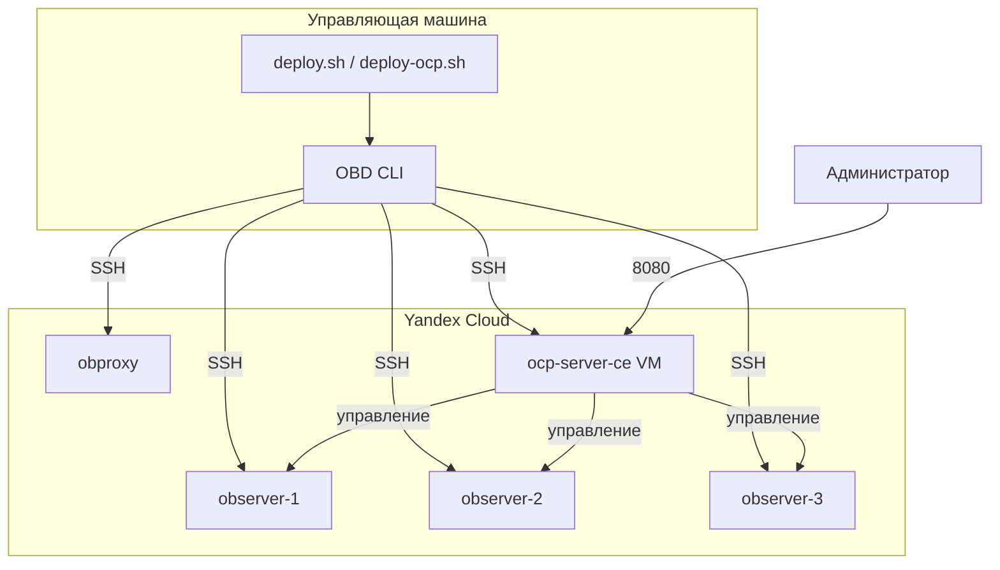

# Развёртывание OceanBase Cloud Platform (OCP)

[OceanBase Cloud Platform (OCP)](https://www.oceanbase.com/docs/ocp) — веб-консоль для управления кластером OceanBase: мониторинг, O&M, установка и масштабирование.

Скрипты этого репозитория разворачивают OCP на **отдельной виртуальной машине** в Yandex Cloud и устанавливают `ocp-server-ce` через [OBD](https://www.oceanbase.com/docs/common-obd-cn-1000000005246289) поверх уже развёрнутого кластера OceanBase.

## Архитектура


```mermaid
flowchart TB
  subgraph control [Управляющая машина]
    OBD[OBD CLI]
    Scripts[deploy.sh / deploy-ocp.sh]
  end

  subgraph yc [Yandex Cloud]
    O1[observer-1]
    O2[observer-2]
    O3[observer-3]
    P[obproxy]
    OCP[ocp-server-ce VM]
  end

  Scripts --> OBD
  OBD -->|SSH| O1 & O2 & O3 & P & OCP
  User[Администратор] -->|8080| OCP
  OCP -->|управление| O1 & O2 & O3
```

OCP использует мета-тенанты `ocp_meta` и `ocp_monitor` в кластере OceanBase. При integrated deploy OBD создаёт их автоматически на этапе `oceanbase-ce`.

## Требования

| Компонент | Назначение |
|-----------|------------|
| Отдельная ВМ OCP | 4+ vCPU, 16+ GB RAM (по умолчанию в `vm_profiles.ocp`) |
| Java 8+ в `/usr/bin/java` | Устанавливается скриптом `prepare-ocp-host.sh` |
| `clockdiff` | Пакет `iputils-clockdiff` (Ubuntu) |
| chrony | Ставится на шаге `prepare` (`prepare-chrony.sh`) |
| Кластер OceanBase | Минимум 3 observer + obproxy (как в основном сценарии) |
| OBD | Развёртывание `ocp-server-ce` |

## Быстрый старт

1. Скопируйте и отредактируйте конфигурацию:

```bash
cp config/deploy.yaml.example config/deploy.yaml
```

2. Включите OCP:

```yaml
vm_profiles:
  ocp:
    enabled: true
    count: 1
    cores: 4
    memory_gb: 16

ocp:
  enabled: true
  port: 8080
  admin_password: <secure-password>   # 8–32 символа, ≥3 класса: цифры, a-z, A-Z, спец. (OBD-1025)
  root_password: <oceanbase-root-password>
  proxyro_password: <proxyro-password>
```

3. Полное развёртывание (OceanBase + OCP):

```bash
./scripts/deploy.sh all
```

Или только OCP (если кластер OceanBase уже развёрнут):

```bash
./scripts/deploy-ocp.sh all
```

## Пошаговый режим

```bash
./scripts/deploy-ocp.sh check       # проверка профиля и зависимостей
./scripts/deploy-ocp.sh provision   # создание OCP-ВМ в YC
./scripts/deploy-ocp.sh prepare     # chrony, Java, clockdiff, диски
./scripts/deploy-ocp.sh config      # obd-cluster.yaml с ocp-server-ce
./scripts/deploy-ocp.sh deploy      # obd cluster deploy + start
```

Основной сценарий `./scripts/deploy.sh` при включённом OCP в config выполняет те же шаги в рамках `all`: provision создаёт все ВМ (включая OCP), prepare подготавливает OCP-ВМ, config и deploy добавляют `ocp-server-ce`.

## Профиль ВМ OCP

По умолчанию (`config/deploy.yaml.example`):

| Параметр | Значение | Назначение |
|----------|----------|------------|
| cores | 4 | Минимум для OCP server |
| memory_gb | 16 | JVM + OCP services |
| boot_disk | 50 GB io-m3 | ОС и бинарники |
| data_disk | 186 GB io-m3 | Пакеты (`soft_dir`), логи (`log_dir`) |

Проверка:

```bash
python3 scripts/lib/vm_profiles.py validate --config config/deploy.yaml
python3 scripts/lib/vm_profiles.py resolve ocp --config config/deploy.yaml --format json
```

## Параметры `ocp` в config

| Параметр | Описание |
|----------|----------|
| `enabled` | Включить развёртывание OCP |
| `port` | HTTP-порт веб-консоли (8080) |
| `admin_password` | Пароль admin OCP. OBD-1025: длина 8–32, не меньше трёх классов из цифр, строчных, заглавных и спец. (`~!@#%^&*_-+=\|(){}[]:;,.?/$`'\"<>`) |
| `memory_size` | Память JVM OCP (8G по умолчанию) |
| `home_path`, `soft_dir`, `log_dir` | Каталоги на OCP-ВМ |
| `root_password`, `proxyro_password` | Пароли `root@sys` / `proxyro`. После bootstrap OBD выполняет `ALTER USER`; нужны ≥8 символов и ≥2 класса (цифры/буквы/спец.). `changeme` даёт OBD-5000 и зависание start. |
| `meta_tenant`, `monitor_tenant` | Имена и ресурсы тенантов OCP |

## Доступ к консоли

После успешного `deploy`:

```
http://<OCP_1_IP>:8080
```

Учётные данные: `ocp.admin_username` / `ocp.admin_password` из `config/deploy.yaml`.

IP-адрес OCP-ВМ сохраняется в `generated/inventory.env` (`OCP_1_IP`). На этой ВМ нет observer: слушает **8080** (OCP), не 2881. `obd cluster display` покажет `ocp-server-ce` на `OCP_1_IP` и `oceanbase-ce` на 30 observer — это один OBD-деплой, не два кластера OceanBase.

### Пустой список кластеров в UI

Старт `ocp-server-ce` поднимает консоль и пишет метаданные в тенанты `ocp_meta` / `ocp_monitor` **внутри основного oceanbase-ce**. Сам кластер в раздел «Кластеры» OCP **не попадает**, пока его не зарегистрировать:

```bash
./scripts/deploy.sh ocp-register
```

Это `obd cluster check4ocp -V <версия OCP>` + `obd cluster export-to-ocp <deploy> -a http://<OCP_1_IP>:8080 -u admin -p …`. `./scripts/deploy.sh deploy` / `all` при включённом OCP сначала делают `ocp-clockdiff` (wrapper `-o`), затем этот register. После этого в UI появляется задача takeover; по завершении виден кластер с `appname` (`oceanbase.cluster_name`, в gist — `obcluster`, `cluster_id=1`).

`check4ocp` без `-V` в OBD по умолчанию считает OCP **3.1.1** и печатает:

```text
[ERROR] The current user must be the admin user. Run the edit-config command to modify the user.username field
oceanbase-ce Check passed.
```

Это не поломка кластера и не ошибка SSH. `user.username` в конфиге OBD — OS-пользователь на ВМ (`obadmin`), не логин консоли OCP (`admin`). Проверка действует только для OCP < 4.2.0; для ocp-server-ce 4.2+ её снимает явный `-V`. **Не** меняйте `user.username` на `admin` — сломается SSH к observer.

Скрипт `./scripts/deploy.sh ocp-register` сам резолвит версию (`ocp.version`, YAML OBD, `/api/v2/info`, иначе 4.4.2) и всегда вызывает `check4ocp -V`. Вручную:

```bash
obd cluster check4ocp ob-yc-prod -V 4.4.2
obd cluster export-to-ocp ob-yc-prod -a http://<OCP_1_IP>:8080 -u admin -p '<ocp.admin_password>' \
  --host_type yandex-cloud --credential_name obadmin-ssh
```

### Другие сообщения OBD при ocp-register

| Сообщение | Значение | Нужен ли фикс |
|-----------|----------|----------------|
| `The current user must be the admin user` | OBD без `-V` считает OCP 3.1.1 | да, `-V 4.4.2`; **не** менять SSH на `admin` |
| `Failed to install repository oceanbase-ce-utils …` | … | нет, не блокирует. Если есть `takeover task successfully submitted to ocp` — задача уже в UI |
| `Pre check for create host` / `Execute clock diff failed` / `diffWithIcmpTimestamp` / `args=[<ip>]` без `-o` | OCP mode 0 + Ubuntu PATH: JVM берёт `/usr/sbin/clockdiff` (ELF), а не wrapper в `/usr/bin`. Даже `-o` на YC часто exit 1. | да: `./scripts/deploy.sh ocp-clockdiff` ставит wrapper в **sbin и bin** и пишет `ocp.host.check.clock-diff.enable=false`. Затем Retry той же задачи. |
| `abnormal Cgroup configuration` | Ubuntu 22.04 — cgroup v2, OceanBase изоляция CPU — cgroup v1. Баннер, не причина падения pre-check. | не reboot всего кластера. Позже: GRUB `systemd.unified_cgroup_hierarchy=0` или `ALTER SYSTEM SET enable_cgroup=false` |
| `do takeover … You must specify the value of the given parameter` | OCP `POST /api/v2/ob/clusters/takeOver` получил пустое поле. Типично `"port": null`: OBD берёт `mysql_port` **только из** `oceanbase-ce.global`, а генератор раньше писал порт лишь в `serverN`. Пустой `--host_type` на свежем OCP создаёт тип хоста с `name=""` — та же ошибка | да: `mysql_port` в global + `--host_type yandex-cloud` |

`Configurations of the oceanbase-ce can be taken over by OCP` после WARN utils — precheck прошёл. Кластер при этом уже развёрнут; пустой список в UI — пока takeover не принят. Если задача takeover зависла в **Taking over** и subtask «Pre check for create host» FAILED с `Execute clock diff failed` — это не SSH: OCP с JVM-хоста запускает локально `clockdiff <observer>` (часто `/usr/sbin`, mode 0, ICMP TIMESTAMP). Yandex Cloud это режет. Исправление:

```bash
./scripts/deploy.sh ocp-clockdiff
```

Затем в UI Retry **той же** задачи (не второй takeover). Баннер про Cgroup на Ubuntu 22.04 — отдельно, не этот FAIL.

Если API не достучалась до System Parameters — вручную: `ocp.host.check.clock-diff.enable=false` (или `clock-diff.mode=1`). Chrony на ВМ уже есть.

`ERROR: Expecting value: line 1 column 1` после `OCP clockdiff ready` — HTML логина вместо JSON API, не сбой clockdiff. В этом случае параметр задайте в UI, затем Retry.

Запасной путь — ручной Take over в UI (таблица ниже).

Если export-to-ocp недоступен — в UI «Take over cluster»:

| Поле | Значение |
|------|----------|
| Адрес | `OBPROXY_1_IP` (не IP OCP-ВМ) |
| Порт | `2883` (`oceanbase.ports.obproxy`) |
| Режим | proxy |
| Имя кластера | `oceanbase.cluster_name` (`obcluster`) |
| Cluster ID | `1` |
| Пароль | `ocp.root_password` (`root@sys`) |

Проверка тенантов на observer, не на ocp-1:

```bash
mysql -h<OBSERVER_1_IP> -P2881 -uroot -p -e \
  "SELECT tenant_name FROM oceanbase.DBA_OB_TENANTS;"
```

Нет `ocp_meta` — полный `obd cluster start` oceanbase-ce не дошёл до создания OCP-тенантов (типично при зависании на `obshell bootstrap`). Сначала доведите start / тенанты, потом `ocp-register`. `check4ocp` может требовать identity obshell `CLUSTER AGENT`.

## Ограничения

- **Integrated deploy** — OCP разворачивается вместе с OceanBase через один `obd cluster deploy`. Добавление OCP к уже работающему кластеру может потребовать `obd cluster redeploy` или ручного добавления компонента.
- **Сеть** — OCP-ВМ должна иметь доступ к observer и obproxy по внутренней сети YC.
- **Пароли** — `ocp.admin_password` должен удовлетворять OBD-1025. `ocp.root_password` / `proxyro_password` — не слабее 8 символов и 2 классов: иначе после `oceanbase bootstrap ok` будет `OBD-5000 ALTER USER` и `obd cluster start` может «зависнуть».
- **OBD-5000 `set idc = %s`** — `%s` это плейсхолдер лога OBD, не буквальное значение. Пачка таких ошибок сразу по всем zone плюс `alter user "root"` означает, что упал сам `alter system bootstrap` (OBD печатает его ошибку только в verbose-лог), а не отдельные `modify zone`. Тот же сбой часто выглядит как зависание на `obshell bootstrap -` после `oceanbase bootstrap ok`. Диагностика — `./scripts/deploy.sh diagnose`, `obd display-trace` и `observer.log`. Разбор частого случая (больше трёх zone) — [«Zone и bootstrap»](large-physical-cluster-recommendations.md#12-zone-и-bootstrap-почему-ровно-три-zone).

## Ссылки

- [Deploy OCP via OBD](https://en.oceanbase.com/docs/community-obd-en-10000000000862277)
- [OCP documentation](https://www.oceanbase.com/docs/ocp)
- [Пример OBD config](https://github.com/oceanbase/obdeploy/blob/master/example/ocp/distributed-with-obproxy-and-ocp-example.yaml)
